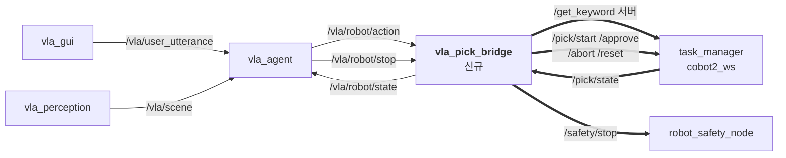

# 인수인계 — M0609_VLA_system → cobot2_ws 통합

작성 2026-08-09 · 기준 커밋 `5a10649`(+ 미커밋 변경 있음, §1.2)

## 0. 이 문서에 대해

**읽는 사람**: 이 repo를 이어받는 사람, 그리고 `cobot2_ws`(대상 프로젝트) 쪽에서 VLA를 붙이는 사람.

**전제**: 통합 시 **대상 프로젝트(`~/cobot2_ws`, `gwanhuiGIM/0730_cobo2_personal@semi_Final`)가 우선권을 가진다.**
그쪽 `md/plans/2026-08-08-vla-integration.md` §0이 역할 경계를 이미 확정해 뒀고, 이 문서는 그 경계를 받아들인
상태에서 **우리 기능을 어디까지·어떻게 넘길 수 있는지**를 정리한다.

> 그쪽 §0 원칙: *"VLA는 입력 하나가 늘어나는 것이지 실행 계층을 대체하는 것이 아니다."*
> 로봇 행동(모션·IK·충돌회피·그리퍼)과 6D 파지 계산은 `cobot2_ws`. "어떤 물체를 집을지"는 VLA.

**단일 출처 관계** — 값이 어긋나면 아래가 이긴다.

| 주제 | 정본 |
|---|---|
| 우리 시스템 설계·동작 원리 | [README.md](README.md) |
| 우리 파라미터 값 | [src/vla_system/config/system.yaml](src/vla_system/config/system.yaml) |
| 통합 경계·역할 분담 | 대상 repo `md/plans/2026-08-08-vla-integration.md` |
| 대상 패키지 인터페이스 | 대상 repo `src/PACKAGES.md` |
| **이 문서** | 위 넷을 잇는 **통합 작업 지시서**. 값을 여기에 다시 적지 않고 링크한다 |

---

## 1. 현상황

### 1.1 가장 중요한 사실 — 하드웨어 전제가 다르다

우리 코드 전체가 이 리그를 전제로 쓰였고, **대상 리그는 다르다.** 통합 난이도의 90%가 여기서 나온다.

| | 우리 (`M0609_VLA_system`) | 대상 (`cobot2_ws`) |
|---|---|---|
| 로봇 | M0609 + RG2 | **같음** (dsr01, 192.168.1.100) |
| 장면 카메라 | 고정 Webcam **C270** (테이블 조망) | 고정 **D435i** (eye-to-hand, 작업대 옆) |
| 파지 카메라 | **손목 RealSense D435I** | **없음** — 위 D435i 한 대뿐 |
| 좌표 산출 | table homography (픽셀→base, 깊이 없음) | depth 역투영 + `T_cam2base.npy` |
| 모션 실행 | Doosan 네이티브 `amovel`/`amovej` ([moves.py](src/vla_system/vla_system/robot/moves.py)) | **MoveIt** (`move_group` + JTC) |
| 파지 생성 | GraspGenX (손목 점군) | GraspGenX (고정 카메라 점군) |
| 상위 제어 | LLM 직결 | **`pick_fsm` 상태머신** |
| PC | VLA PC | GPU PC (별도) — **링크는 휴대폰 핫스팟** |
| `ROS_DOMAIN_ID` | 미지정(=0) | **93** |

> 🔴 **손목 카메라는 대상 리그에 존재하지 않는다.** 대상 `CLAUDE.md`가 *"손목/eye-in-hand RealSense는
> 존재하지 않는다 (출처는 별도 repo `~/M0609_VLA_system`)"* 라고 명시적으로 정정해 뒀다.
> 우리 `vla_wrist` 전체(약 1,400줄)가 이 한 줄 때문에 넘어가지 못한다.

> 🔴 **모션 경로를 둘 다 켤 수 없다.** 대상의 `task_manager`가 **로봇 명령 배타권 소유자**다.
> `dsr_controller2`(네이티브 movej/movel)와 `dsr_moveit_controller`(JTC)가 **같은 DRFL TCP 연결 하나**를
> 공유하므로 동시에 명령하면 모션 모드가 충돌한다. 우리 `vla_robot`은 켜는 것 자체가 금지다.

### 1.2 repo 상태

- 브랜치 `main`, 최신 커밋 `5a10649`.
- ⚠️ **대상 repo의 통합 계획서는 `5a10649` 스냅샷을 읽고 쓰였다.** 그 이후 **미커밋 변경 1,451줄**이
  작업 트리에 있다 (`git diff --stat`). 주 내용은 손목 파지 비동기화(`wrist_grasp_node` +675,
  `robot_node` +362, `moves.py` +337) — **어차피 폐기 대상**이라 통합에 영향은 작다.
  살아남는 변경은 [vla_gui.py](src/vla_system/vla_system/vla_gui.py) +61(파이프라인 로그 파일화,
  손목 annotated 뷰)과 [system.yaml](src/vla_system/config/system.yaml) +68이다.
- 미추적 파일: `src/doosan-robot2/`(overlay 중복 빌드 방지용 `COLCON_IGNORE` 필요),
  `perception/wrist_tracking.py`, 테스트 3개, `msg/TcpPose.msg`(index에서 삭제된 뒤 재생성된 상태 — 커밋 시 정리 필요).

### 1.3 검증 상태

```bash
source /opt/ros/humble/setup.bash && source install/setup.bash
export PYTHONPATH="$PWD/src/vla_system:$PYTHONPATH"
python3 -m pytest -q src/vla_system/test
# → 241 passed
```

⚠️ **[scripts/check.sh](scripts/check.sh)는 지금 그대로는 안 돈다.** 새로 추가된
`test_node_construction.py` · `test_wrist_async_state.py`가 빌드된 `vla_interfaces`를 import하므로,
"ROS 없이 순수 로직만"이라는 원래 전제가 깨졌다. 위처럼 워크스페이스를 source해야 한다.
(README의 "196 passed / ROS 불필요" 서술은 이 시점에 낡았다.)

| 항목 | 상태 |
|---|---|
| 단위 테스트 241개 | ✅ 통과 (워크스페이스 source 필요) |
| DRY-RUN 3노드 실제 기동 + 대화 시나리오 8종 | ✅ 확인 (README「실제 ROS 런타임에서 확인한 것」) |
| 실기 로봇 모션 | ❌ 미검증 |
| 테이블 보정 실측 | ❌ 미검증 |
| 손목 파지 실기 | ❌ 미검증 |
| **대상 시스템과의 연동** | ❌ **한 번도 안 붙여봤다.** 양쪽 다 소스만 읽은 상태 |

---

## 2. 전체 기능 목록과 사용법

각 기능의 **적용 등급**: 🟢 **A** = 바로 적용 · 🟡 **B** = 수정 후 적용 · 🔴 **C** = 폐기

### 2.1 🟢 A — `vla_agent` (LLM 판단 계층) · 449줄 + agent/ 465줄

**하는 일**: 결정 시점마다 LLM을 호출해 무엇을 할지 정한다. 대화 히스토리 유지, function calling,
정지 epoch 관리. **이 시스템에서 판단하는 유일한 노드다.**

```bash
ros2 run vla_system agent_node --ros-args --params-file src/vla_system/config/system.yaml
```

| 구분 | 인터페이스 | 타입 |
|---|---|---|
| sub | `/vla/user_utterance` | `std_msgs/String` |
| sub | `/vla/scene` | `vla_interfaces/SceneSnapshot` |
| sub | `/vla/robot/state` | `vla_interfaces/RobotState` (TRANSIENT_LOCAL) |
| sub | `/vla/estop` | `std_msgs/String` |
| pub | `/vla/robot/action` | `vla_interfaces/RobotAction` |
| pub | `/vla/robot/stop` | `std_msgs/String` |
| pub | `/vla/agent/reply` | `vla_interfaces/AgentReply` |

핵심 파라미터: `model`(기본 `gpt-5-mini`) · `max_tool_rounds`(4) · `max_history_items`(60) ·
`max_consecutive_failures`(3) · `continue_after_action`(true) · `request_timeout_s`(30).
API 키는 `.env`의 `OPENAI_API_KEY` 또는 환경변수.

**결정 시점은 3개뿐이다** — 사용자가 말했을 때 / 동작이 끝났을 때 / 정지가 걸렸을 때.
매 프레임 호출하지 않는다. LLM 왕복은 워커 스레드에서 돌아 executor를 막지 않는다.

**LLM이 부를 수 있는 함수** ([agent/tools.py](src/vla_system/vla_system/agent/tools.py)):

| 함수 | 하는 일 |
|---|---|
| `pick_and_place(object_id, say)` | 집어서 장바구니에 담는다 |
| `pick_and_hold(object_id, say)` | 집어서 든 채로 대기 |
| `release(say)` | 들고 있는 것을 현재 위치에 놓는다 |
| `cancel_current_action(say)` | 진행 중 동작 즉시 중단 |
| `ask_clarification(question, object_ids)` | 애매하면 추측하지 않고 되묻는다 |
| `wait(say)` | 지금 할 일 없음 |

**모든 함수에 `say`가 필수 인자**다. 사용자가 듣는 것은 오직 그 문장뿐이라, 자유 텍스트에
기대면 로봇이 이유 없이 조용해진다.

**반드시 함께 넘어가야 하는 설계 두 가지**:

1. **정지 epoch 게이트** ([agent_node.py:363-373](src/vla_system/vla_system/nodes/agent_node.py#L363-L373)) —
   판단 시작 시점의 `stop_epoch`을 기억하고, 동작을 발행하기 직전 값이 바뀌었으면 발행하지 않는다.
   LLM 왕복이 수 초라 그 사이에 정지가 들어오면 **정지 이전의 세계관으로 만든 동작이 정지 이후에
   나갈 수 있다.**
2. **`RobotAction.header.stamp` = 판단을 *시작*한 시각** — 실행자가 마지막 정지 시각과 비교해
   늦게 도착한 명령을 거부한다. 에이전트가 정지를 듣기 전에 이미 보낸 메시지도 막힌다.

### 2.2 🟢 A — `vla_gui` (입출력) · 1,238줄

**하는 일**: 텍스트/음성 입력, STT, 정지 키워드 로컬 처리, 되묻기 crop 표시, 파이프라인 기동/정리.

```bash
ros2 run vla_system vla_gui
```

- **정지 키워드는 LLM을 거치지 않는다.** `정지|멈춰|멈춤|그만|중지|스톱|스탑|stop|halt` 정규식을
  GUI가 로컬에서 잡아 `/vla/estop`을 즉시 발행한다. ESC 키와 화면 우상단 **■ 정지** 버튼도 같은 경로.
- STT는 OpenAI `gpt-4o-transcribe`. `ask_clarification`의 `object_ids`를 받으면 annotated 프레임에서
  해당 물체를 잘라 번호를 붙여 보여주고, 사용자는 "1번"으로 답한다.
- 파이프라인 로그는 `~/.ros/vla_system/pipeline.log`에 전량 저장된다(채팅창엔 관심 토큰만 표시).

### 2.3 🟡 B — `vla_perception` (인식) · 376줄 + perception/ 754줄

**하는 일**: 고정 Webcam 캡처 → YOLO-seg 인스턴스 분할 → IoU 추적(안정 id) → 마스크 색상 판정 →
table homography로 base 좌표 → `SceneSnapshot` 발행.

```bash
ros2 run vla_system perception_node --ros-args --params-file src/vla_system/config/system.yaml
```

| 구분 | 인터페이스 |
|---|---|
| pub | `/vla/scene` (`SceneSnapshot`) · `/vla/perception/annotated_image` (`Image`) |

**넘어가는 부분**: [detector.py](src/vla_system/vla_system/perception/detector.py)(257) ·
[tracker.py](src/vla_system/vla_system/perception/tracker.py)(188) ·
[color_features.py](src/vla_system/vla_system/perception/color_features.py)(196) ·
[object_matching.py](src/vla_system/vla_system/perception/object_matching.py)(113).

**넘어가지 못하는 부분**: [table_homography.py](src/vla_system/vla_system/perception/table_homography.py)(236)와
[table_homography_test_node.py](src/vla_system/vla_system/nodes/table_homography_test_node.py)(623).
→ 적용 방법은 §5.1.

> 💡 대상의 `/yolo_seg/classes`에는 **안정적 인스턴스 id도 색상도 없다** (`obj_N`은 프레임마다 바뀐다).
> 우리 IoU 추적기와 HSV 색상 판정이 그 구멍을 정확히 메운다 — 이게 우리 인식 코드가 살아남는 이유다.

### 2.4 🔴 C — `vla_robot` (모션 실행) · 938줄 + robot/ 848줄

**하는 일**: `RobotAction`을 실제 모션으로. 정지 경로 소유. 로봇 실제 상태 발행.

```bash
ros2 run vla_system robot_node --ros-args -p motion_enabled:=false   # DRY-RUN
```

**폐기 사유**: §1.1 — `task_manager`가 로봇 명령 배타권을 가지고, 두 모션 경로는 공존할 수 없다.

**폐기해도 넘겨야 할 지식 3가지**:
- 모든 긴 모션을 `amovel`/`amovej`(비블로킹)로 발행하고 `poll_interval_s`(20 ms)마다 취소 플래그를
  확인한다. 블로킹 `movel`은 정지가 들어와도 그 구간이 끝날 때까지 반영되지 않는다.
- `MoveStop` 서비스 클라이언트는 **모션 워커가 아닌 노드 자신의 executor** 위에 둔다. 워커 스레드가
  Doosan API를 쥐고 있어도 충돌하지 않는다.
- **비동기 서비스 수락 ≠ 모션 완료.** 매 구간 후 실측 TCP/관절을 검증해야 거부된 명령이 성공으로
  둔갑하지 않는다 (`motion_position_tolerance_m` 등).

### 2.5 🔴 C — `vla_wrist` (손목 파지) · 998줄 + 439줄

**하는 일**: 손목 RealSense YOLO-seg 추적 → hand-eye 변환 → GraspGenX 6-DOF 파지 생성 → `GraspPlan` 발행.

**폐기 사유**: 손목 카메라가 대상 리그에 없다. 좌표 체인 전체가 `posx(TCP) @ T_gripper2camera`와
`expected_tcp_name: GripperDA_v1`에 묶여 있어 고정 eye-to-hand에서는 성립하지 않는다.

**🔑 폐기해도 반드시 넘겨야 할 실측값** — 대상의 미해결 항목 **D4**에 직접 들어가는 입력이다:

| 측정 | 결과 |
|---|---|
| GraspGenX 자세 원점 → 물체 표면 | 중앙값 **158.8 mm** |
| `원점 + R @ fingertip` → 표면 (fingertip `[0,0,0.18]`) | 중앙값 **4.3 mm** |
| fingertip 방향 · R의 3열 | **1.000000** (= 접근축은 local **+Z**) |

즉 `onrobot_RG2`의 GraspGenX 출력 4x4는 **그리퍼 base** 기준이고 실제 접촉점은 `원점 + R@fingertip`이다.
**이걸 적용하지 않으면 모든 파지가 정확히 180 mm 빗나가는데, 로봇에서는 "캘리브레이션이 나쁜 것"처럼
보여 원인을 찾기 어렵다.** 대상은 지금 `grasp_bridge_node.py`의 `tcp_offset_m: 0.18`과 `pick_fsm`의
실측 0.218 m가 갈린 상태(D4)이므로, 위 표가 그 논의의 실측 근거가 된다.

### 2.6 🔴 C — `table_homography_test` · 623줄

테이블 보정 측정 도구. 픽셀→base XY, 최소제곱 테이블 평면에서 Z. 보정 JSON은 `~/.ros/vla_table_homography.json`,
`image_size`를 함께 저장해 해상도가 바뀌면 거부한다. → 대상은 depth가 있으므로 불필요.

### 2.7 🟡 B — `process_guard` · 185줄

**하는 일**: **VLA 시작**을 누를 때마다 남아있는 파이프라인 프로세스를 `SIGINT → SIGTERM → SIGKILL`로 정리.
자기 자신과 조상 프로세스는 절대 건드리지 않고, 좀비는 살아있는 것으로 세지 않는다.

우리 쪽 launch에만 쓴다. 다만 **정리 대상 프로세스 이름 패턴이 우리 노드 이름에 묶여 있어**
대상 파이프라인엔 그대로 못 쓴다. 대상은 `pkill -f` 금지 규칙(공유 랩탑, 자기 셸을 먼저 죽임)이 있으므로,
필요하면 이 코드의 **조상 보호 · 좀비 판정 로직**만 가져가는 게 맞다.

### 2.8 🔴 C(경계 통과 불가) — `vla_interfaces` 커스텀 msg 8종

`SceneObject` · `SceneSnapshot` · `RobotAction` · `RobotState` · `AgentReply` · `TcpPose` ·
`GraspRequest` · `GraspPlan`.

**PC 경계를 넘길 수 없다.** 양쪽에 같은 인터페이스 패키지를 빌드·배포해야 하고, 한쪽만 갱신되면
**타입 해시가 어긋나 조용히 매칭이 끊긴다** — 에러가 아니라 "토픽은 보이는데 데이터가 안 옴"으로
나타나서 도메인/방화벽 문제와 구분이 안 된다. 대상 §2가 `std_msgs/String`(JSON)으로 확정했고,
그쪽에 이미 같은 패턴의 선례가 있다(`/yolo_seg/classes`).

→ **우리 msg는 VLA PC 내부에서만 쓰고, 경계에서는 브리지가 JSON으로 번역한다.**

---

## 3. 적용 분류 요약

| 기능 | 줄수 | 등급 | 조치 |
|---|---:|:---:|---|
| `vla_agent` + `agent/` | 914 | 🟢 A | 도구 목록만 재매핑 (§5.2) |
| `vla_gui` | 1,238 | 🟢 A | 정지 경로만 2선으로 강등 (§5.4) |
| `perception/` 코어 (검출·추적·색상) | 754 | 🟡 B | 입력 교체 (§5.1) |
| `perception_node` | 376 | 🟡 B | homography 제거 + 픽셀 출력 (§5.1) |
| `process_guard` | 185 | 🟡 B | 우리 PC 한정 유지 |
| `table_homography*` | 859 | 🔴 C | 폐기 |
| `vla_robot` + `robot/` | 1,786 | 🔴 C | 폐기 (지식 3건 이관) |
| `vla_wrist` + `grasp/` | 1,437 | 🔴 C | 폐기 (실측값 이관) |
| `vla_interfaces` | — | 🔴 C | 내부 전용, 경계는 JSON |

**약 2,900줄이 살아남고, 약 4,100줄이 폐기되며, 약 560줄이 재배선된다.**

---

## 4. 바로 적용 가능한 것 — Phase 1 (대상 코드 수정 **0줄**)

### 4.1 왜 0줄로 되는가 — `/get_keyword`가 비어 있다

대상 `task_manager`는 `LISTENING` 상태에서 `/get_keyword`(`std_srvs/Trigger`)를 **호출**하고
`res.message.split()[0]`을 타겟 클래스로 삼는다. 그런데 그쪽 `voice_processing` 패키지는 지금
**`COLCON_IGNORE`로 빌드에서 빠져 있다** — `setup.py`가 gitignore된 `resource/.env`를 강제해
빌드가 실패하기 때문이고, 그쪽 `CLAUDE.md`가 *"지금은 안 쓰고 추후 VLA 노드 통합 때 되살린다"*고
적어 뒀다.

> **즉 `/get_keyword` 슬롯은 지금 비어 있고, VLA를 위해 예약돼 있다.**
> 우리 에이전트가 이 서버를 구현하면 `pick_fsm`은 한 줄도 안 고친다.

### 4.2 신규 노드 하나만 만든다 — `vla_pick_bridge`

우리 쪽(VLA PC)에 새 노드 하나. 대상 쪽엔 아무것도 안 만든다.



굵은 선이 **핫스팟을 넘는 구간**이다. 넘는 것은 서비스 호출 4개 + 상태 문자열 1개뿐 — 매우 가볍다.

### 4.3 상태 매핑 (`/pick/state` → 우리 `RobotState`)

| `pick_fsm` 상태 | `status` | 비고 |
|---|---|---|
| `IDLE` | `idle` | |
| `LISTENING` | `idle` | 우리 `/get_keyword` 응답 대기 중 |
| `PERCEIVE` `SCENE_PREP` `PLAN` | `moving` | 아직 안 움직이지만 사이클 진행 중 |
| `WAIT_APPROVAL` | `moving` | **+ 신규 이벤트 `approval_required` 발생** (§4.5) |
| `STOW` `APPROACH` `OPEN_GRIPPER` `DESCEND` `CLOSE` | `moving` | |
| `VERIFY` `LIFT` `PLACE` | `holding` | 대상의 `HOLDING_STATES`와 일치 |
| `RELEASE` `HOME` | `moving` | |
| `SPEAK_FAIL` | → `last_result=failed` | |
| `ABORT` `SAFE_STOP` | `stopping` | **`/pick/reset` 없이는 안 풀린다** |

`last_result` 판정: `HOME → IDLE` 도달 = `succeeded` · `SPEAK_FAIL` 진입 = `failed` ·
`SAFE_STOP` 진입 = `cancelled`.

### 4.4 도구 재매핑

| 우리 도구 | Phase 1 매핑 | 상태 |
|---|---|---|
| `pick_and_place(object_id)` | `/get_keyword` 응답에 **클래스명** 반환 + `/pick/start` | 🟡 개체가 아니라 클래스까지만 |
| `pick_and_hold` | — | 🔴 제거 (§5.2) |
| `release` | — | 🔴 제거 (§5.2) |
| `cancel_current_action` | `/safety/stop` → `/pick/abort` | 🟡 이후 reset 필요 |
| `ask_clarification` | 변경 없음 | 🟢 우리 쪽에서 완결 |
| `wait` | 변경 없음 | 🟢 |
| **`approve_plan(say)`** 🆕 | `/pick/approve` | 신규 |
| **`resume_after_stop(say)`** 🆕 | `/pick/reset` | 신규 |

### 4.5 🔴 반드시 지켜야 할 제약 3가지 (대상 코드를 읽고 확인한 것)

1. **`LISTENING` 제한시간은 60초다** (`DEFAULT_TIMEOUTS[State.LISTENING] = 60.0`).
   우리 `/get_keyword` 서버가 60초 안에 응답하지 않으면 **`ABORT` → `SAFE_STOP`**으로 떨어지고
   `/pick/reset`이 필요해진다. 사용자가 60초 동안 말이 없는 것은 정상 상황이므로,
   **브리지는 타임아웃 전에 "대기" 의미의 실패 응답을 스스로 반환**하고 다음 사이클을 받아야 한다.
2. **`SPEAK_FAIL → LISTENING` 왕복은 `MAX_FAIL_STREAK = 3`에서 `IDLE`로 내려앉는다.**
   실패를 3번 반환하면 사람이 `/pick/start`를 다시 불러야 재개된다 — 브리지가 그 재개를 담당해야 한다.
3. **`_service()`는 논블로킹이다** (`call_async` + 매 tick 확인). 우리 서버가 몇 초 블로킹해도
   FSM tick은 멈추지 않는다. LLM 왕복 시간은 위 60초 예산 안에서는 문제없다.

### 4.6 기동 순서

```bash
# ── 대상 PC (cobot2_ws) ─ 터미널마다 첫 줄
export ROS_DOMAIN_ID=93

ros2 launch m0609_rg2_bringup bringup.launch.py mode:=real rviz:=false   # T1 로봇
ros2 launch m0609_rg2_moveit  moveit.launch.py  standalone:=false        # T2 MoveIt
ros2 launch m0609_rg2_bringup camera.launch.py                           # T3 카메라
scripts/graspx_container.sh run_bridge:=false device:=0 classes:='[46,47]'  # T4 YOLO(컨테이너)
ros2 run graspgenx_perception grasp_bridge_node                          # T5 파지(호스트)
ros2 launch pick_fsm pick_fsm.launch.py grasp_source:=legacy_trigger     # T6 FSM
```

> ⚠️ `grasp_source:=legacy_trigger`를 **명시해야 한다.** 기본값 `compute_grasp`가 부르는
> `/grasp/compute_grasp` 서버는 그쪽 워크스페이스 어디에도 구현이 없다.
> ⚠️ `dry_run:=true` + `require_approval:=true`가 **기본값**이다. 대화 루프 검증은 이 상태에서 전부 된다.

```bash
# ── VLA PC (우리) ─ 반드시 도메인을 맞춘다
export ROS_DOMAIN_ID=93
export FASTRTPS_DEFAULT_PROFILES_FILE=<cobot2_ws>/fastdds_udp_only.xml

ros2 run vla_system perception_node --ros-args --params-file src/vla_system/config/system.yaml
ros2 run vla_system agent_node      --ros-args --params-file src/vla_system/config/system.yaml
ros2 run vla_system vla_pick_bridge     # 신규
ros2 run vla_system vla_gui
```

**증상 구분** (대상의 2026-08-07 A/B 실측에서 온 규칙): 토픽 자체가 안 보이면 **도메인**,
토픽은 보이는데 데이터가 0이면 **프로파일/방화벽**, 데이터는 오는데 프레임이 뚝뚝 끊기면 **대역폭**.

### 4.7 Phase 1으로 되는 것 / 안 되는 것

✅ 대화 맥락 파악 · 되묻기 · **어떤 클래스를 집을지 LLM 결정** · 시작/승인/중단/재개 전부 LLM
❌ 개체 지목("그 사과 말고 다른 사과") · hold/release · place 목적지 지정

---

## 5. 수정이 필요한 것 — 무엇을 어떻게

### 5.1 `vla_perception` — 입력을 대상 카메라로 교체

**왜**: 대상 §3-3이 D435i **압축 컬러**를 VLA PC로 보내기로 확정했다(핫스팟 대역폭 때문에
raw 55 Mbps·포인트클라우드 245 Mbps는 논외, JPEG는 ~1.5–2 Mbps). 그러면 물체를 가리키는 가장 정확한
방법이 base XY가 아니라 **그 프레임의 픽셀 (u,v)** 가 되고, 캘리브가 대상 것 하나뿐이라
오차 합산 문제가 통째로 사라진다.

| 무엇 | 어떻게 |
|---|---|
| 이미지 소스 | `webcam_device` V4L2 직접 열기 → `/camera/camera/color/image_raw/compressed` 구독 (`SensorDataQoS`) |
| homography 호출 | 전부 제거. `calibration_file` · `grasp_height_offset_m` · `require_inside_table` 파라미터 삭제 |
| `SceneObject.position_base` | 채우지 않음. 대신 **마스크 무게중심 픽셀 + 그 프레임 해상도**를 싣는다 |
| `SceneObject.position_valid` | 의미 재정의: "픽셀 지목이 가능한가"(마스크가 유효한가) |
| 검출·추적·색상 | **변경 없음** |

> 픽셀을 박스 중심이 아니라 **마스크 무게중심**으로 잡는 우리 규칙은 여기서도 그대로 유효하다.
> 기울어진 바나나나 일부 가려진 컵에서는 박스 중심이 물체 옆 테이블에 떨어진다.

**LLM 프롬프트도 같이 고쳐야 한다** ([agent/prompt.py](src/vla_system/vla_system/agent/prompt.py)) —
`position_base(로봇 좌표 m)` 서술과 6번 규칙(`pickable`)이 좌표 기반이므로 픽셀 기반으로 다시 쓴다.

**⚠️ 이중 검출 문제**: 우리 YOLO(VLA PC)와 대상 YOLO(컨테이너)가 각자 돌아 서로 다른 물체 목록을
가질 수 있다. 다만 지시가 "픽셀 → 최근접 obj"라 **어긋남에 관대하다** — 이게 픽셀 경로의 좋은 성질이다.
근본 해결은 Phase 3(§6).

### 5.2 도구 목록 축소 — `pick_and_hold` / `release` 제거

**왜**: 대상 FSM은 `...LIFT → PLACE → RELEASE → HOME`으로 고정이다. "들고 대기"도 "여기 놓기"도
**상태 자체가 없다.** 추가하려면 `states.py`의 `TRANSITIONS`를 고쳐야 하는데 그건 §0 "의존성 최대한
보존" 원칙과 정면으로 충돌한다.

**어떻게**: [tools.py](src/vla_system/vla_system/agent/tools.py)의 `TOOLS`에서 두 항목을 빼고
`MOTION_TOOLS`를 `("pick_and_place",)`로 줄인다. 프롬프트에서 관련 서술을 지운다.
[agent_node.py](src/vla_system/vla_system/nodes/agent_node.py)의 `release` 분기와
테스트 `test_tools_schema.py` · `test_agent_conversation.py`를 같이 고친다.

### 5.3 취소 → 재개 경로

**왜**: 우리는 "취소 → 곧바로 다음 지시 가능"이다. 대상은 `ABORT → SAFE_STOP`에 머무르고
**`/pick/reset`을 명시적으로 불러야** `HOME`을 거쳐 `IDLE`로 돌아온다.
(`SAFE_STOP`에서 곧장 `IDLE`로 안 가는 이유: 팔이 물체 높이에 남은 채 재촬영하면 **그리퍼 자신이
물체로 오인식된다** — 대상의 2026-08-07 실기 관찰이다.)

**어떻게**: 두 선택지.
- **(권장)** 브리지가 `SAFE_STOP` 관측 시 자동으로 `/pick/reset`을 걸고, 우리 `RobotState`에는
  `cancelled`만 노출한다. LLM은 기존 의미대로 동작하고 도구가 늘지 않는다.
- LLM에게 `resume_after_stop` 도구를 준다. 재개 시점을 LLM이 판단하지만 도구가 하나 늘고
  프롬프트 규칙도 늘어난다.

### 5.4 🔴 정지 경로 재설계 — 가장 안전 민감한 항목

**왜**: 우리 원칙은 *"정지는 LLM을 거치지 않는다"* 였다. 이제 **휴대폰 핫스팟도 거치지 않아야 한다.**
DDS 멀티캐스트 탐색은 핫스팟에서 기기마다 동작이 다르고, **탐색만 실패하고 에러는 안 난다.**
그 상태에서 우리 GUI의 "정지"는 조용히 도달하지 않는다.

**어떻게** — 3선 방어:

| 선 | 수단 | 위치 |
|---|---|---|
| 1선 | 물리 E-stop 버튼 / 티치펜던트 | 로봇 옆, 사람 손 |
| 2선 | `rqt --standalone pick_fsm` 빨간 버튼 → `/safety/stop` | **대상 PC 로컬** (`robot_safety_node`는 별도 프로세스라 FSM이 죽어도 먹는다) |
| 3선 | 우리 GUI 정지 키워드 / ESC → 브리지 → `/safety/stop` + `/pick/abort` | VLA PC, **네트워크 경유** |

우리 GUI의 정지를 **없애지는 않는다** — 대화 중 "멈춰"가 가장 자연스러운 입구다. 다만
**1선이 아니라 3선임을 문서와 GUI 문구에 명시**하고, 정지 JSON/서비스만은 `RELIABLE` QoS로 보낸다
(영상은 `BEST_EFFORT`).

### 5.5 정지 epoch 게이트를 브리지로 이전

**왜**: `pick_fsm`에는 "정지 이전에 결정된 명령이 늦게 도착하면 거부" 검사가 **없다.**
늦게 도착한 `/pick/approve`는 그대로 실행된다. 우리 쪽에만 있던 안전장치라 우리가 계속 져야 한다.

**어떻게**: [agent_node.py:363-373](src/vla_system/vla_system/nodes/agent_node.py#L363-L373)의 epoch
검사를 브리지에도 복제해, `/pick/start`와 `/pick/approve`를 **호출하기 직전에** 다시 확인한다.
에이전트 쪽 검사만으로는 부족하다 — 브리지에서 서비스 호출까지 사이에도 시간이 흐른다.

### 5.6 `max_scene_age_s` 재해석

우리 `max_scene_age_s: 2.0`은 **webcam 씬 신선도**다. 대상 §5가 이걸 "지시 TTL"과 혼동하지 말라고
경고해 뒀다 — **같은 개념이 아니므로 값을 맞추려 하지 말 것.** 지시 TTL은 대상이 별도로 10초 초안을 잡았다.
한편 우리가 좌표를 더 이상 공급하지 않으므로(픽셀만 지목) 이 파라미터의 위험 자체가 크게 줄어든다.

---

## 6. Phase 2 / 3 — 대상 쪽 작업이 필요한 것

### Phase 2 — 개체 선정 (대상 §5, **설계만 있고 코드 0줄**)

"그 사과 말고 다른 사과"는 **여기서만 살아난다.** 지금 `/grasp/compute`는 점수 최고를 고를 뿐이다.

- 대상이 `capture_graspgenx_scene.py`에 `select_by_point()`를 추가하고
  `grasp_bridge_node.py:285`(`segment()` 직후)에 꽂는다. 워커 호출 **전**이라 GraspGenX 연산도 1개로 준다.
- 우리는 `/vla/pick_command`(`std_msgs/String` JSON)를 발행한다:
  ```json
  {"cmd":"pick","class":"apple","pixel":[312,188],"pixel_wh":[424,240],
   "request_id":"a17-3","stamp_ns":1754640000123456789}
  ```
  ⚠️ **`pixel_wh` 생략 불가.** 우리가 리사이즈한 프레임 위에서 찍었으면 좌표가 조용히 어긋난다.
  받는 쪽이 원본 해상도로 스케일링하고, 값이 없으면 거부한다.
- 파라미터는 **우리와 같은 이름·같은 값**으로 맞춘다: `match_tolerance_m: 0.06`,
  `refuse_ambiguous_match: true`. 서로 다른 허용오차를 쓰면 "VLA는 지목했는데 우리가 못 찾는다"가 난다.

> 대상도 이 작업을 **VLA와 무관하게 필요하다**고 보고 우선순위 1번에 올려놨다(사람이 `rqt_image_view`
> 클릭으로 고르는 경로). 픽셀 경로가 확정되면서 **클릭과 VLA 지시가 같은 입력**이 됐다 —
> VLA는 "사람 대신 클릭하는 클라이언트"가 된다.

### Phase 3 (선택) — 씬 JSON 역방향

대상이 물체 목록(label · class · conf · base XY · 픽셀 중심)을 JSON 토픽으로 내주면, LLM이
**파지 파이프라인이 보는 것과 정확히 같은 것**을 본다. §5.1의 이중 검출 문제가 사라지고
우리 YOLO를 이중으로 돌릴 필요도 없어진다. `select_by_point()`가 이미 그 값들을 계산하므로
추가 비용은 작다.

---

## 7. 결정이 필요한 항목

| # | 질문 | 기본 권고 |
|---|---|---|
| **H1** | `/pick/approve`를 LLM에게 줄 것인가 | **초기엔 사람.** `require_approval`은 "사람이 궤적을 보고 승인"이 원래 의도다. 실기 안정화 후 파라미터로 넘긴다 |
| **H2** | `pick_and_hold`/`release`를 뺄 것인가, FSM에 상태를 추가할 것인가 | **뺀다.** 추가는 대상 우선권 원칙과 충돌하므로 그쪽 합의가 먼저다 |
| **H3** | 취소 후 재개를 브리지 자동 reset으로 할 것인가, LLM 도구로 줄 것인가 | **브리지 자동** (§5.3) |
| **H4** | 우리 YOLO를 계속 돌릴 것인가(Phase 3까지) | **돌린다.** 안정 id·색상이 되묻기의 전제다 |
| **H5** | D435i 해상도 (대상 D5 미해결) | 대상 실기에서 `rs-enumerate-devices` 확인 후. **`480x320`은 지원 목록에 없어 보인다.** 해상도는 octomap·nvblox 두 경로에 동시에 걸리므로 VLA 편의로 올리면 대상 octomap이 먼저 밀린다 |

---

## 8. 인수 직후 확인 체크리스트

```bash
# ── 우리 쪽
cd ~/M0609_VLA_system
git log --oneline -1                      # 5a10649 인지, 그 뒤 커밋이 있는지
git status --porcelain                    # §1.2의 미커밋 변경이 그대로인지
source /opt/ros/humble/setup.bash && source install/setup.bash
export PYTHONPATH="$PWD/src/vla_system:$PYTHONPATH"
python3 -m pytest -q src/vla_system/test  # 241 passed 인지

# ── 대상 쪽 (실기 PC에서)
export ROS_DOMAIN_ID=93
ros2 service list | grep -E "get_keyword|pick/|safety/"   # get_keyword 가 비어 있는지 확인
ros2 service list | grep grasp                            # /grasp/compute 만 있고 compute_grasp 는 없어야 정상
ros2 topic echo /pick/state --once

# ── 링크 (핫스팟 연결 후)
iperf3 -c <상대_IP> -t 10                 # 실효 대역폭. 압축 컬러 ~2 Mbps 가 들어가는지
ros2 topic bw /camera/camera/color/image_raw/compressed
ros2 topic list | grep vla                # 도메인이 맞으면 양쪽 토픽이 서로 보인다
```

---

## 9. 문서 지도

| 알고 싶은 것 | 문서 |
|---|---|
| 우리 시스템이 왜 이렇게 생겼나 | [README.md](README.md) |
| 우리 파라미터 의미 | [src/vla_system/config/system.yaml](src/vla_system/config/system.yaml) (주석이 본체) |
| 이전 구조에서 무엇이 바뀌었나 | [MIGRATION.md](MIGRATION.md) |
| 테이블 보정 측정 절차 | [TABLE_HOMOGRAPHY_TEST.md](TABLE_HOMOGRAPHY_TEST.md) |
| 통합 역할 경계 (대상 정본) | 대상 `md/plans/2026-08-08-vla-integration.md` |
| 대상 패키지 인터페이스·파라미터 | 대상 `src/PACKAGES.md` |
| 대상 실기 제약 (1000줄+) | 대상 `md/context/constraints.md` |
| 대상 실행 명령 정본 | 대상 `config/testcommand.md` |

---

## 10. 한 문단 요약

우리 시스템에서 대상 프로젝트로 넘어가는 것은 **판단 계층**이다 — LLM 에이전트, 대화 기억,
되묻기, 그리고 인식의 안정 id·색상. 넘어가지 못하는 것은 **실행 계층 전부** — 모션, 손목 파지,
테이블 homography. 대상 `pick_fsm`이 `/get_keyword`를 비워 둔 채 VLA를 기다리고 있어서
**Phase 1은 대상 코드를 한 줄도 고치지 않고** 붙는다: LLM이 무엇을 집을지·언제 시작할지·
실행할지 말지·언제 멈출지·언제 재개할지를 전부 쥔다. 남는 진짜 갭은 하나, **개체 선정**이다.
대상이 `select_by_point()`를 구현하기 전까지 LLM은 "사과"까지만 말할 수 있고 "그 사과"는 말할 수 없다.
