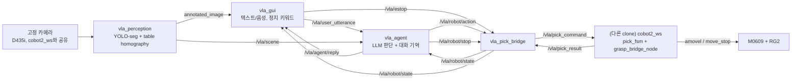

# 자연어 대화 기반 자율 피킹 로봇팔

사용자가 계속 말을 걸면 로봇이 맥락을 이해하고 물건을 집어 장바구니에 담는 시스템이다.
Doosan M0609 + OnRobot RG2 기준.

🔴 **카메라 구성 (2026-08-10 확인, 2026-08-11 코드 반영)**: 고정 카메라는 별도
Logitech C270가 아니라, 로봇 실행을 전담하는 `cobot2_ws`의 `pick_fsm`이 쓰는 것과
**같은 물리 D435i**다(공유). `vla_perception`은 이제 그 카메라를 직접 열지 않고
ROS 토픽(`image_topic`)을 구독한다 — 아래 "좌표가 어디서 오는가" 절이 현재 코드를
그대로 설명한다. 상세·근거는
[`docs/context/constraints.md`](docs/context/constraints.md) "카메라 구성" 참고.

🔴 **로봇 실행은 이 ws에 없다 (2026-08-11).** `robot_node`(자체 모션/그리퍼
제어)와 `wrist_grasp_node`(손목 RealSense + GraspGenX 정밀 파지)는 삭제됐다.
이 ws는 **무엇을(class) 어디로(place) 집을지만 판단**해서 `cobot2_ws`의
`pick_fsm`에 넘긴다 — 실제 모션·IK·충돌회피·그리퍼·정밀 그립 계산은 전부
`cobot2_ws` 쪽 코드다.

"사과는 네가 담을거야" → 로봇이 사과를 집어 담고, 담는 도중 "그 사과는 집지마" →
지금 향하던 사과를 즉시 취소한다.

## 설계 원칙

**인식과 좌표 변환만 고정 로직이다. 나머지 판단은 전부 LLM이 한다.**

무엇을 집을지, 무엇을 빼고 들지, 애매하면 되물을지는 코드의 상태머신이 아니라
LLM이 결정한다. 규칙 매처(`matcher.py`), 대상 큐(`target_queue`),
되묻기 상태 플래그(`awaiting_clarification`)는 전부 제거했고, 그 역할은 대화
히스토리와 function calling이 대신한다.

- LLM은 **영상을 직접 보지 않는다.** 그 순간의 탐지 결과를 구조화된 JSON
  스냅샷으로만 받는다.
- LLM은 **매 프레임이 아니라 "결정 시점"에만** 호출된다 — 사용자가 말했을 때,
  그리고 로봇이 동작을 끝냈을 때.
- **"정지"는 LLM을 거치지 않는다.** GUI가 키워드를 로컬에서 잡아
  하드웨어 중단 서비스를 직접 호출한다.

## 구조



| 노드 | 책임 | 판단하는가 |
|---|---|---|
| `vla_perception` | 고정 카메라 캡처, YOLO-seg 인스턴스 분할, IoU 추적, 마스크 색상, table homography로 base 좌표(GUI 표시용, 판단에는 안 씀) | 아니오 (고정 로직) |
| `vla_agent` | 결정 시점마다 LLM 호출, 대화 히스토리 유지, function calling. class(물체)와 place(목적지)만 판단 — 좌표/모션은 판단하지 않음 | **예 (무엇을/어디로만)** |
| `vla_pick_bridge` | 유일한 실행 경로. `RobotAction`→`/vla/pick_command` JSON 발행(`class`만 넘김, 좌표는 안 넘김), `/vla/pick_result`→`RobotState` 역변환 | 아니오 (변환만) |
| `vla_gui` | 입출력, STT, 정지 키워드 하드코딩, 되묻기 crop 표시 | 정지 키워드만 |

🔴 **`robot_node`/`wrist_grasp_node`는 삭제됐다 (2026-08-11).** 실제 모션·IK·
충돌회피·그리퍼·손목 카메라 기반 정밀 그립 계산은 전부 `cobot2_ws`의
`pick_fsm`/`grasp_bridge_node`가 전담한다. 이 다이어그램의 `FSM` 박스가 다른
git clone(`~/cobot2_ws`)의 별도 프로세스라는 뜻이다.

## LLM이 호출할 수 있는 함수

| 함수 | 하는 일 |
|---|---|
| `pick_and_place(object_id, place, reason)` | 집어서 지정한 곳(`basket`/`table`/`discard`, 미언급 시 `basket`)에 놓는다 |
| `cancel_current_action()` | 진행 중인 동작을 즉시 중단한다 |
| `ask_clarification(question, object_ids)` | 애매하면 추측하지 않고 되묻는다 |
| `wait()` | 지금은 할 일 없음 |

🔴 `pick_and_hold`/`release`는 삭제됐다(2026-08-11) — cobot2_ws의 `pick_fsm`은
"쥔 채 대기"/"제자리에 놓기" 개념이 없어 항상 pick→place까지 진행하고, 이 둘의
유일한 소비자였던 `robot_node`도 함께 삭제됐다.

`object_ids`를 넘기면 GUI가 `annotated_image`에서 해당 물체들을 잘라
번호를 붙여 보여주고, 사용자는 "1번"으로 답할 수 있다.

## LLM이 보는 것

매 결정 시점마다 아래가 새로 만들어져 주입된다. scene은 히스토리에 쌓이지 않는다 —
30초 전 좌표를 근거로 추론하는 일을 막기 위해서다.

```json
{
  "event": {"type": "user_said", "text": "사과 담아줘"},
  "scene": {
    "visible_objects": [
      {"id": "apple_17", "class": "apple", "color": "red",
       "pickable": true, "position_base": [0.42, -0.18, 0.05]},
      {"id": "apple_22", "class": "apple", "color": "red",
       "pickable": true, "position_base": [0.51, -0.10, 0.04]}
    ]
  },
  "robot_state": {"status": "idle", "holding": null, "motion_enabled": false}
}
```

`robot_state`는 LLM의 기억보다 항상 우선한다. 대화 히스토리는 로봇의 "기억"이지만,
실제로 무엇을 쥐고 있는지는 매번 `vla_pick_bridge`가 cobot2_ws로부터 받은 값으로
덮어쓴다(단, `/vla/pick_result`에는 holding 필드가 없어 `holding`은 이 경로에서
항상 `null`이다 — cobot2_ws가 그 정보를 발행하기 전까지는 구조적 한계).

## 정지가 실제로 즉시 먹히는 이유

1. GUI가 "정지"를 로컬 정규식으로 잡아 `/vla/estop`을 즉시 발행한다.
   STT→LLM 왕복을 기다리지 않는다.
2. `vla_pick_bridge`가 정지 시각을 기록하고, `cmd:"abort"`를 조건 없이
   cobot2_ws로 발행한다(진행 중인 요청이 있든 없든 — "없으면 스킵"이 정지 경로가
   해서는 안 되는 유일한 추측이기 때문). 실제 모션 중단은 cobot2_ws의 `pick_fsm`이
   수행한다.

ESC 키와 화면 우상단 **■ 정지** 버튼도 같은 경로다.

**진행 중인 "판단"도 무효화한다.** LLM 왕복은 몇 초가 걸리므로, 그 사이에 정지가
들어오면 정지 *이전*의 세계관으로 만들어진 동작이 정지 *이후*에 발행될 수 있다.
두 겹으로 막는다.

- `vla_agent`는 판단 시작 시점의 stop epoch을 기억하고, 동작을 발행하기 직전에
  epoch이 바뀌었으면 발행하지 않는다.
- `vla_pick_bridge`는 `RobotAction.header.stamp`(판단을 *시작*한 시각)가 마지막
  정지보다 이르면 거부한다. 에이전트가 정지를 듣기 전에 이미 메시지를 보냈더라도
  막힌다.

## 좌표가 어디서 오는가

🔴 **2026-08-11 갱신**: 탐지 카메라는 별도 Webcam이 아니라 **cobot2_ws의 `pick_fsm`도
쓰는 고정 D435i다(공유 하드웨어)**. `vla_perception`은 그 카메라를 직접 열지 않고
`image_topic`(기본 `/camera/camera/color/image_raw`)을 **구독**한다 — 실제로 카메라를
여는 건 `realsense2_camera` 드라이버(cobot2_ws 연동 시엔 그쪽 launch, 이 저장소만 단독
실행할 땐 이 ws가 직접 띄운 `realsense2_camera`) 하나뿐이고, 이 노드는 몇 개든 붙을 수
있는 구독자 중 하나다. 예전엔 `cv2.VideoCapture`로 `/dev/videoN`을 직접 열었는데,
카메라가 진짜 공유라는 게 확정된 뒤(2026-08-10) 그 방식은 cobot2_ws의 드라이버와 같은
장치를 두 프로세스가 독립적으로 여는 충돌 위험이 있어 바꿨다(`docs/context/constraints.md`
"카메라 구성" 참고). RealSense는 depth를 갖고 있지만, 이 경로는 color 프레임만 쓰고
깊이는 안 쓴다 — 아래 homography가 여전히 그 자리를 메운다(D435i 자체 depth로 넘어가는
건 이번 변경 범위 밖).

🔴 **2026-08-11부터 이 좌표는 실행에 안 쓰인다.** `vla_pick_bridge`는 `class`만
cobot2_ws에 넘기고 좌표는 절대 넘기지 않는다 — 실제 그립 좌표는 cobot2_ws의
`pick_fsm`이 자기 D435i로 직접 계산한다(`robot_node.py`/`table_homography.py`
소비자가 삭제되면서 이 경로는 순수 정보용이 됐다). 아래는 `vla_perception`이 여전히
계산은 하는 이유(GUI 디버그 패널 표시, ⚠ 보정 경고) 설명이다.

카메라가 뭘 발행하든 이 노드가 쓰는 건 색상 프레임 한 장뿐이라 깊이가 없다. 그래서
좌표는 `table_homography_test`로 측정한 테이블 보정에서 온다: 픽셀 → base XY, 그리고
최소제곱으로 맞춘 테이블 평면에서 Z.

- 매핑하는 픽셀은 박스 중심이 아니라 **마스크 무게중심**이다. 기울어진 바나나나
  일부가 가려진 컵에서는 박스 중심이 물체 옆 테이블에 떨어질 수 있다.
- 표시되는 Z는 `테이블 평면 + grasp_height_offset_m`이다(정보용 — 실제 그립 Z는
  cobot2_ws가 독립적으로 계산한다).
- 보정 사각형 **밖**의 물체는 좌표를 받지 못한다. 그 밖에서는 homography가
  외삽이고 평면도 함께 외삽된다. 물체 자체는 장면에 남으므로 GUI 표시에는
  뜨지만 좌표 칸은 비어 있다.

보정은 **픽셀 좌표**라서 해상도가 바뀌면 전부 무의미해진다. 그래서 보정 JSON에
`image_size`를 함께 저장하고, 구독한 첫 프레임의 해상도가 다르면 보정을 거부한다
(`image_topic`을 발행하는 쪽 — 보통 `realsense2_camera`의 `color_profile` 인자 —
해상도가 바뀌면 재보정 필요).

## cobot2_ws 연동에서 카메라를 공유하는 방식

🔴 **2026-08-11 확인**: cobot2_ws 연동 경로(§3/§4, GUI 기본값)에서는 물체 구분과
GraspGenX가 **같은 물리 D435i 한 대**를 토픽으로 나눠 씁니다. 카메라를 여는
프로세스(`realsense2_camera_node`)는 정확히 하나(cobot2_ws 쪽 launch 또는 사용자가
직접 켠 alias — 예: `reals1280`)이고, 나머지는 전부 그 토픽의 구독자입니다:

| 구독자 | 어디 | 하는 일 |
|---|---|---|
| `vla_perception`(이 ws) | M0609_VLA_system | `image_topic` 색상 프레임 구독 → YOLO-seg → LLM이 보는 장면 |
| `yolo_seg_node` | cobot2_ws | 같은 색상 프레임 구독 → cobot2_ws 자체 세그멘테이션(mask/label 발행) |
| `grasp_bridge_node`/`graspgen_worker` | cobot2_ws | depth + `yolo_seg_node`의 라벨 구독 → GraspGenX 6-DOF 파지 계산 |

세 프로세스 다 `cv2.VideoCapture`나 장치 파일을 직접 열지 않습니다(`yolo_seg_node`의
`acquire_singleton()`도 카메라가 아니라 **자기 출력 토픽**에 거는 잠금이라, 카메라
자체는 여전히 다중 구독을 허용합니다) — 그래서 이 ws의 `vla_perception`이 옆에서
같은 프레임을 봐도 장치 경합이 없습니다.

**여기서 개체 지정(같은 클래스 물체가 2개 이상일 때 "어느 것")도 이미 연결돼 있습니다** —
이 ws의 `vla_pick_bridge`가 보내는 `pixel`/`pixel_wh`(bbox 중심 픽셀, 재투영 없음)를
cobot2_ws의 `grasp_bridge_node`가 `select_by_point()`로 실제로 소비하는 경로가
**2026-08-11 cobot2_ws 쪽에서 구현 완료**됐습니다(`vla_command_node`의
`pixel_policy` 파라미터: `warn`(기본, 무시하고 클래스만 사용)/`reject`/`select`).
**단, 기본값은 여전히 `warn`이라 opt-in입니다** — cobot2_ws가
`pixel_policy:=select`로 띄워야 실제로 픽셀 기반 개체 선정이 동작합니다. 이 ws
쪽은 이미 픽셀을 보내고 있으니 추가 작업 없이 그 스위치만 켜면 됩니다.

🔴 **손목 RealSense/GraspGenX 정밀 파지 경로는 2026-08-11 이 ws에서 완전히
삭제됐다** (`wrist_grasp_node.py`, `grasp/*`, `perception/wrist_geometry.py`,
`perception/wrist_tracking.py` — CLAUDE.md #3). 예전에는 여기서 "동일 객체 판정",
"GraspGenX 자세 규약", "TCP 일치", "관찰 자세", "실측 비용" 같은 상세 설계를
다뤘지만, 그 코드와 함께 삭제했다 — 필요하면 git 히스토리에 남아 있다. 정밀 파지
계산은 이제 cobot2_ws의 `grasp_bridge_node`/`graspgen_worker`가 전담한다(위
"cobot2_ws 연동에서 카메라를 공유하는 방식" 참고).

## 시작할 때 찌꺼기를 먼저 정리하는 이유

**VLA 시작**은 누를 때마다 먼저 남아있는 파이프라인 프로세스를 정리한다.

GUI를 닫거나 죽여도 그것이 띄운 `ros2 launch`는 살아남는다 — OS 차원의 부모-자식
종료 연결이 없기 때문이다. 그래서 새 GUI는 이전 실행을 기억하지 못하고, 그대로
시작하면 `vla_pick_bridge_node`가 둘이 되어 cobot2_ws에 서로 다른 동작을 동시에
보낸다.
launch에서 노드 하나만 죽어 형제들보다 오래 남는 경우도 있다. 찌꺼기는 예외가
아니라 정상 상황이라서, 사용자에게 터미널에서 정리하라고 요구하지 않고 매번
자동으로 처리한다.

- `SIGINT` → `SIGTERM` → `SIGKILL` 순으로 올린다. `SIGINT`에서 rclpy가 정상
  종료하며 gripper 클라이언트를 놓기 때문에 이것이 먼저다.
- 다 죽으면 즉시 넘어간다. 정상적인 노드 3개는 **0.1초**, 완전히 굳은 노드가
  섞여 있어도 상한이 7초다.
- `SIGKILL`에도 남는 것이 있으면 그때만 시작을 막고 알린다.
- **자기 자신과 자기 조상 프로세스는 절대 건드리지 않는다.**
  `bash -c "... ros2 launch vla_system ..."` 같은 래퍼 셸은 자기 명령줄에 launch
  명령을 담고 있어서 `pgrep`에 파이프라인처럼 잡힌다. 그걸 죽이면 정리 도중에
  호출자가 사라진다.
- 좀비는 살아있는 것으로 세지 않는다. `os.kill(pid, 0)`은 좀비에도 성공하므로,
  신호만으로는 자기가 방금 죽인 자식의 사망을 확인할 수 없다.
- 🔴 **RealSense 카메라 프로세스는 조건부로만 정리한다(2026-08-11 수정)**. cobot2_ws
  연동 모드(`enable_realsense:=false`로 뜨는 launch)에서는 카메라를 남이 잡고
  있다는 전제라 정리 대상에서 뺀다 — 안 뺐더니 실기 세션에서 사용자가 직접 켠
  카메라(`reals1280` alias)를 GUI가 "leftover"로 오인해 죽인 사고가 있었다. 단독
  모드(이 ws가 직접 `enable_realsense:=true`로 카메라를 열 때)는 예전처럼 정리
  대상에 포함한다 — 두 RealSense 노드는 절대 공존할 수 없다는 원래 이유는 그대로
  유효하다. `_clear_leftover_pipeline(include_realsense=...)`.

로직은 `vla_system/process_guard.py`에 있다 — tkinter도 ROS도 없이 테스트할 수
있도록 GUI에서 분리했다.

## 설치

Ubuntu 22.04 + ROS 2 Humble 기준.

```bash
cd ~/M0609_VLA_system
source /opt/ros/humble/setup.bash

sudo apt update
sudo apt install -y ros-humble-realsense2-camera portaudio19-dev python3-tk

# ⚠️ --user 로 깔지 않는다 — 이 계정(kimkh)은 ~/cobot2_ws 와 공유한다. ~/.local 은 계정
# 전역이라 여기서 pip install --user 로 깐 opencv-python/pydantic 등이 cobot2_ws 의
# colcon build·rclpy 노드를 조용히 깬다(2026-08-10 실측 — CLAUDE.md §1).
# 이 ws 는 rclpy 가 필요한 진짜 ROS 패키지라 일반 venv 는 안 되고 --system-site-packages 다.
python3 -m venv --system-site-packages .venv
source .venv/bin/activate
python3 -m pip install -r requirements.txt
# --system-site-packages 의 apt packaging(21.3)과 최신 setuptools 가 안 맞을 수 있다
# (2026-08-10 실측 — vla_interfaces 빌드가 TypeError 로 죽었다):
python3 -m pip install "setuptools<80,>=30.3.0" "packaging>=23"
```

OpenCV는 apt(`python3-opencv`, jammy에서 4.5.4)가 아니라 pip로 받는다 —
`ultralytics`가 `opencv-python>=4.7`을 요구한다. 대신 4.x에 머물러야 한다:
`opencv-python` 5.x는 NumPy 2를 강제하고, NumPy는 ROS 2 Humble ABI 호환을 위해
1.x로 고정돼 있다. `requirements.txt`가 이 조합을 이미 못박아 뒀다.

**설치 전후로 `~/cobot2_ws` 가 멀쩡한지 확인한다** (같은 계정을 공유하므로):

```bash
source /opt/ros/humble/setup.bash && source ~/cobot2_ws/install/setup.bash
cd ~/cobot2_ws && colcon build --symlink-install --packages-select voice_processing pick_fsm
```

이게 실패로 바뀌었으면 방금 설치가 `~/.local`을 건드린 것이다 — `.venv` 활성화 없이
`pip install`을 부르지 않았는지부터 본다. 상세는 `CLAUDE.md` §1.

🔴 **`~/.local/lib/python3.10/site-packages/`를 눈으로도 한 번 확인할 것** (2026-08-10
실측 — 이 계정에서 실제로 발견됨): `pip check`가 조용히 넘어가도 이 폴더에 `anyio`,
`sounddevice`, 부분 설치된 `nvidia`/`cuda` 폴더처럼 dist-info 없는 잔해가 남아있을 수
있다. `.venv` 만들기 *전에* `pip install`을 한 번이라도 벗어난 상태로 불렀다면 남는
흔적이다 — 지금 당장 뭔가를 깨진 않아도(apt `pytest`/`colcon build`는 정상 동작 확인),
CLAUDE.md §1이 경고하는 바로 그 패턴이라 방치하면 다음 번 `~/.local`이 다시 앞순위로
끼어들 때 조용히 문제가 된다. 지우기 전에 `pip show --files <패키지>`로 무엇이 설치했는지
먼저 확인할 것 — 이 ws가 만든 게 아니면 임의로 지우지 않는다.

Doosan ROS 2 패키지(`dsr_common2`, `dsr_msgs2`, `DSR_ROBOT2`)가 들어 있는
overlay를 먼저 source한다. `scripts/env.sh`가 ROS · Doosan overlay ·
이 워크스페이스 · `.env`를 한 번에 올려준다.

```bash
export DOOSAN_SETUP=~/cobot_ws/install/setup.bash   # overlay 위치가 다르면 여기서 지정
source scripts/env.sh
./scripts/build.sh
source scripts/env.sh    # install/ 이 생긴 뒤 한 번 더
```

`src/`에 `doosan-robot2`를 같이 뒀다면 `COLCON_IGNORE`를 넣어 overlay와 이중
빌드되지 않게 한다.

## API 키

```bash
cp src/vla_system/.env.example .env
nano .env          # OPENAI_API_KEY=...
```

또는 `export OPENAI_API_KEY='...'`.

## 실행

### 1. GUI로 시작

`vla_robot`(DRY-RUN 모션 시뮬레이션)은 삭제됐다 — 로봇을 흉내 낼 필요 없이,
cobot2_ws의 `pick_fsm`을 안 띄운 채로 "cobot2_ws FSM 연동" 체크를 꺼두면
`vla_pick_bridge_node`도 안 뜨고 아무것도 실행되지 않는다. 대화 흐름, 되묻기,
정지 경로, 물체 인식만 이 상태로 검증할 수 있다(동작 명령은 발행되지만 받는
쪽이 없어 그냥 사라진다).

```bash
source scripts/env.sh

ros2 run vla_system vla_gui
```

GUI에서 **VLA 시작**을 누르면 파이프라인이 뜬다. 🔴 **2026-08-11부터 GUI의
"cobot2_ws FSM 연동" 체크박스가 기본 켜짐이다** — 켜진 채로 시작하면
`enable_pick_bridge:=true` + `enable_realsense:=false`(카메라는 cobot2_ws 쪽
launch가 이미 잡고 있다는 전제, 아래 §3/§4)를 같이 보낸다. 이 ws 카메라로 완전히
혼자 돌리고 싶을 때만(예: cobot2_ws 없이 대화·인식 로직만 테스트) 체크를 끈다 — 그
러면 예전 기본값(`enable_realsense:=true`, pick_bridge 꺼짐)으로 돌아간다.

화면 상단 "GraspGenX 뷰어" 버튼은 cobot2_ws의 `grasp_bridge_node`가 기본으로
띄우는 viser 웹뷰어(`http://localhost:8080`)를 새 브라우저 창으로 연다 — ROS
이미지 토픽이 아니라 WebSocket/WebGL 렌더러라 GUI 안에는 못 그린다(2026-08-11).
cobot2_ws의 GraspGenX가 안 떠 있으면 빈 화면/연결 실패만 보인다.

🔴 **Ctrl+C가 안 먹으면(창이 안 닫히면)**: `rclpy.init()`이 심어둔 SIGINT
핸들러와 Tkinter의 콜백 예외 처리가 겹쳐서 예전엔 실제로 안 닫히는 경우가
있었다 — `main()`에 별도 SIGINT 핸들러를 달아 고쳤다(2026-08-11). 여전히 안
닫히면 버그이니 보고할 것.

터미널에서 직접 띄우고 싶으면(GUI 없이):

```bash
ros2 launch vla_system vla_system.launch.py enable_realsense:=false
```

### 2. 실제 로봇 — 🔴 이 ws에서 완전히 삭제됨 (2026-08-11)

**`robot_node.py`/`robot/gripper.py`/`robot/moves.py`와, 손목 카메라로 정밀
그립 포즈를 계산하던 `wrist_grasp_node.py`/`grasp/*`/`perception/wrist_*.py`는
전부 삭제됐다.** cobot2_ws와의 역할 분담을 명확히 하기 위한 결정(CLAUDE.md §3) —
로봇 실행(모션·IK·충돌회피·그리퍼)과 정밀 그립 계산은 처음부터 끝까지
`cobot2_ws`의 `pick_fsm`/`grasp_bridge_node`가 전담한다. 이 ws는 `class`(물체
이름)와 `place`(목적지)만 판단해서 `/vla/pick_command`로 넘긴다 — 좌표 계산도,
모션도, 그립도 이 ws의 코드에는 더 이상 없다.

`enable_robot`/`enable_wrist_grasp`/`motion_enabled` launch 인자는 더 이상
존재하지 않는다 — `vla_system.launch.py`에 그 노드들이 없다. `ros2 launch`는
선언 안 된 인자를 넘겨도 에러 없이 조용히 무시하므로(2026-08-11 직접 확인)
`enable_robot:=false`를 계속 붙여도 무해하지만, 아무 효과가 없으니 빼는 게
맞다.

### 3. cobot2_ws 연동 — `vla_pick_bridge` (2026-08-10 추가, 2026-08-11 유일한 실행 경로로 확정)

실제 로봇 실행은 `cobot2_ws`의 `pick_fsm`이 전담한다(위 2절). 이 ws가 할 일은 LLM이
결정한 `object_id`를 `class`로 바꿔 `/vla/pick_command`(JSON)로 cobot2_ws에 넘기고,
`/vla/pick_result`를 다시 `RobotState`로 되돌리는 것뿐이다 — 그 역할이
`vla_pick_bridge`다.

```bash
ros2 launch vla_system vla_system.launch.py enable_pick_bridge:=true
```

GUI로 켜면 이 인자를 직접 넘길 필요 없다 — "cobot2_ws FSM 연동" 체크박스가
기본 켜짐이라 **GUI + VLA 시작 버튼 한 번**이 위 launch와 같은 조합
(`enable_pick_bridge:=true enable_realsense:=false`)을 대신 실행한다(위 1절).

🔴 **`vla_pick_bridge_node`를 두 개 띄우지 않는다** — 둘 다 `/vla/robot/action`을
구독하고 `/vla/robot/state`를 발행해서 경합한다(GUI는 매 시작마다 leftover
프로세스를 정리해 이 문제를 피한다, `process_guard.py`).

🔴 **이걸로 "UI + launch 하나"까지는 맞지만, 그것만으로 FSM이 자동으로 돌지는
않는다** — 바로 아래 항목 참고.

#### 🔴 `enable_pick_bridge:=true`만으로는 cobot2_ws의 FSM 사이클이 시작되지 않는다

이 노드는 `/vla/pick_command`를 쏘기만 한다. cobot2_ws의 `vla_command_node`는 그걸
"한 건짜리 래치"에 쥐고 있다가 FSM이 `LISTENING`에 들어와야 건네주는데, FSM은
`IDLE`에서 `/pick/start`가 불릴 때까지 멈춰 있다(`pick_fsm/states.py`). 기본 구성
(`auto_start=false`)에서는 **사람이 cobot2_ws 쪽에서 rqt 패널 시작 버튼이나
`/pick/start` 서비스를 직접 눌러야** LLM이 낸 지시가 실제로 소비된다.

VLA의 판단(`pick_and_place` 호출)이 곧 사이클의 시작 트리거가 되게 하려면 —
**이 ws가 아니라 cobot2_ws 쪽**에서 `vla_command_node`를 다음과 같이 띄워야 한다
(다른 clone/프로세스라 여기 launch 파일로는 못 켠다):

```bash
# cobot2_ws에서
ros2 launch voice_processing vla_command.launch.py auto_start:=true
```

`auto_start:=true`는 지시가 도착하면 `vla_command_node`가 대신 `/pick/start`를
불러주는 것뿐이다 — `WAIT_APPROVAL`(실제 grasp 실행 승인)은 별개 스위치
(`require_approval`)라 여전히 사람이 로컬(rqt/음성)로 눌러야 한다. 두 안전장치가
독립적이라 이걸 켜도 승인 단계의 안전성은 줄지 않는다(`vla-bridge-contract.md`
§0-B/§4). **2026-08-10 기준 이 ws에서 이 조합으로 왕복 검증한 적은 없다** — 다음
cobot2_ws 세션에서 `auto_start:=true` + `vla_pick_bridge`를 같이 띄워 확인 필요.

**검증 상태** (2026-08-11, `docs/state.md` "cobot2_ws 통합" 참고):

- ✅ 실제 `cobot2_ws`의 `vla_command_node`와 같이 띄워서 JSON 경계(class/place 파싱,
  accepted/rejected 왕복, TTL 만료)까지 확인함 — `ROS_DOMAIN_ID=93`을 양쪽에 맞춰야
  서로 보인다(기본값이 다르다).
- ❌ `pick_fsm`(실제 grasp 시퀀스, `WAIT_APPROVAL`, 로봇 동작)은 아직 미검증 — 그
  다음 단계는 실기 리스크가 있어 별도로 진행.
- `place`(장바구니/테이블/폐기 지정) 필드는 이제 보낸다 — `pick_and_place` 툴이
  `place`(`basket`/`table`/`discard`)를 필수 인자로 받아 그대로 실어 보낸다. 다만
  `table`/`discard`는 cobot2_ws 쪽 teach가 아직 안 끝나(placeholder 관절값,
  `vla-bridge-contract.md` §5) `vla_pick_bridge`의 `allow_unverified_place`(기본
  `false`)가 막아둔다 — teach 끝나면 그 파라미터만 뒤집으면 된다.
- 🔴 **2026-08-11 갱신**: `pixel`/`pixel_wh`은 이제 보낸다(위 "cobot2_ws 연동에서
  카메라를 공유하는 방식" 참고). cobot2_ws의 `select_by_point()`도 구현 완료됐지만
  **기본은 여전히 무시(`pixel_policy=warn`)** — cobot2_ws가 `pixel_policy:=select`로
  띄우지 않는 한 같은 클래스 물체가 2개 이상이면 "1번"으로 되물어도 여전히 아무
  물체나 집을 수 있다. 이 조합(이 ws pixel 전송 + cobot2_ws `select`)의 실기 왕복은
  아직 검증 안 함.
- `allowed_classes`(cobot2_ws가 인식하는 클래스 목록)와 이 ws YOLO의
  `target_classes`가 이름 단위로 안 맞으면 일부 클래스는 즉시 거부된다. 두 YOLO를
  맞출지는 아직 미정 — 지금은 손대지 않았다.

### 4. FSM 연동 최소 명령 (RealSense는 별도 launch로 이미 떠 있다는 전제)

cobot2_ws `pick_fsm`과 실제로 물려서 돌릴 때 **이 ws에서** 실행해야 하는 명령만
모았다. `enable_realsense:=false`로 이 ws가 카메라를 또 열지 않게 한다 — 이미 다른
launch가 물리 D435i를 잡고 있으므로 겹쳐 열면 V4L2 충돌 위험이 있다(위 "카메라
구성" 참고).

```bash
source scripts/env.sh
DOOSAN_SETUP=~/cobot2_ws/install/setup.bash ./scripts/build.sh   # 코드를 고쳤을 때만
ros2 launch vla_system vla_system.launch.py \
  enable_realsense:=false \
  enable_pick_bridge:=true
```

- `enable_realsense:=false` — RealSense는 다른 launch가 띄운다. 여기서 또 켜면 안 됨.
- `enable_pick_bridge:=true` — `object_id`→`class` 변환 후 `/vla/pick_command`로
  cobot2_ws에 넘기고 `/vla/pick_result`를 되돌리는 역할.
- `ROS_DOMAIN_ID`를 cobot2_ws 쪽과 반드시 맞춘다(기본값이 서로 다르다) — 아래 "검증
  상태" 참고.

이것만으로 cobot2_ws FSM이 자동으로 돌지는 않는다 — `pick_fsm`은 `IDLE`에서
`/pick/start`를 기다린다(사람이 rqt로 누르거나, cobot2_ws 쪽에서
`vla_command.launch.py auto_start:=true`로 띄워야 함, 아래 §3 하단 참고). 이 ws에서
`auto_start`를 대신 켤 방법은 없다 — 다른 clone/프로세스다.

DOOSAN_SETUP 기본값(`~/cobot_ws/install/setup.bash`)은 이 머신에 없다 — 실제 overlay는
`~/cobot2_ws/install/setup.bash`다(2026-08-11 확인). `scripts/env.sh`/`scripts/build.sh`를
쓸 때 위처럼 명시적으로 넘긴다.

## 설정

`src/vla_system/config/system.yaml` 한 파일에 세 노드의 파라미터가 모두 있다.

주요 항목:

| 파라미터 | 의미 |
|---|---|
| `vla_agent.model` | 판단에 쓰는 모델 (기본 `gpt-5-mini`) |
| `vla_agent.max_tool_rounds` | 한 결정 안에서 허용하는 tool 왕복 수 |
| `vla_agent.max_history_items` | 이 개수를 넘으면 오래된 턴부터 통째로 버린다 |
| `vla_agent.max_consecutive_failures` | 연속 실패가 이만큼이면 자동 진행을 멈추고 사용자에게 묻는다 |
| `vla_perception.backend` / `device` | `pytorch` + `cuda:0` (기본) 또는 `openvino` + `intel:gpu` |
| `vla_perception.image_topic` | 고정 D435i color 토픽. 기본 `/camera/camera/color/image_raw` — `realsense2_camera`가 발행하는 것과 같아야 한다 |
| `vla_perception.max_image_age_s` | 이보다 오래된 카메라 프레임은 버린다 (기본 2.0s) |
| `vla_perception.calibration_file` | `table_homography_test`가 저장한 보정. 없으면 좌표가 전부 보류된다 |
| `vla_perception.grasp_height_offset_m` | 테이블 높이에 더해 파지 Z를 만든다 (기본 0.02) |
| `vla_perception.require_inside_table` | 보정 사각형 밖 물체는 좌표를 주지 않는다 (기본 true) |
| `vla_perception.use_masks` | 색상 판정과 테이블에 매핑할 픽셀을 마스크 안쪽으로 제한한다 (기본 true) |
| `vla_pick_bridge.pick_command_topic` / `pick_result_topic` | cobot2_ws `vla_command_node`와 맞닿는 JSON 토픽. 기본값이 그쪽 기본값과 일치해야 한다 |
| `vla_pick_bridge.result_timeout_s` | cobot2_ws가 이 시간 안에 결과를 안 주면 `failed`로 포기한다 (기본 60s, cobot2_ws의 `wait_timeout_sec` 50s보다 여유 있게) |
| `vla_pick_bridge.allow_unverified_place` | `place=table/discard`를 실제로 보낼지 (기본 `false`). cobot2_ws의 teach가 끝나기 전까지 켜지 않는다 |

좌표 단위 계약:

- `SceneObject.position_base`: **m** (GUI 표시용, 실행에는 안 쓰인다)
- `table_homography.py`의 모든 공개 함수와 보정 JSON: **mm** (Doosan API와 맞춤).
  `table_point_from_pixel()`이 유일한 mm→m 경계다

## 테스트

```bash
source /opt/ros/humble/setup.bash && source install/setup.bash  # 🔴 필요 -- 아래 참고
source .venv/bin/activate   # 없으면 위 설치 절부터 (--user 금지 — CLAUDE.md §1)
python3 -m pip install -r requirements-dev.txt
./scripts/check.sh
```

🔴 **ROS 코어(`/opt/ros/humble/setup.bash`)는 여전히 소싱해야 한다** — pytest의
`launch_testing` 플러그인 훅이 collection 시점에 이를 요구한다. 2026-08-11
`wrist_grasp_node`를 쓰던 `test_wrist_async_state.py`(유일하게 `vla_interfaces`
빌드 산출물을 import하던 테스트)를 삭제하면서, `install/setup.bash`(패키지 빌드)
소싱은 더 이상 필요 없다 — 나머지 테스트는 전부 순수 로직만 다룬다.

```text
132 passed
```

커버 범위: 대화 히스토리 트리밍(고아 tool 출력 방지), scene/robot_state 직렬화,
object handle 정규화, IoU 추적 동일성, tool 스키마 strict 규약, 클래스 필터링 후
box↔mask 인덱스 정합, HSV 7색 밴드와 마스크 색상 판정, table homography 좌표
(mm→m 경계, 보정 사각형 밖 거부, 해상도 불일치 거부, 손상된 보정 파일 거부),
잔여 프로세스 정리(신호 단계 상승, 좀비 판정, 조상 프로세스 보호),
`vla_pick_bridge`의 JSON 빌드·result 매핑·object_id→class 조회.

🔴 작업공간 경계·정지 중 파지 상태 보고 등 `robot_node.py`/`grasp/poses.py`
전용 테스트는 그 코드와 함께 삭제됐다(2026-08-11) — 그 안전장치는 이제 이 ws가
아니라 cobot2_ws `pick_fsm` 쪽 코드의 책임이다.

### 실제 ROS 런타임에서 확인한 것 (2026-08-10, 이후 삭제된 `vla_robot` 기준 — 기록용)

🔴 아래 표는 `robot_node.py`(DRY-RUN 모션 시뮬레이션)가 아직 있던 시점의 검증
기록이다. 그 노드는 2026-08-11 삭제됐고, `pick_and_hold`/`release`도 스키마에서
빠졌다 — `release`/`위치 미확정` 행은 지금 아키텍처에는 더 이상 해당하지 않는다.
현재 유효한 것: 모호한 지시·되묻기·정지 경로는 `vla_agent`가 그대로 담당하므로
행 대부분은 지금도 같은 의미다. 새 검증은 `vla_pick_bridge`↔cobot2_ws 실기
왕복(§4 "남은 것")으로 대체됐다.

`colcon build` 후 DRY-RUN으로 세 노드를 실제로 띄워 확인했다 (로봇·카메라 없이,
장면은 가짜 publisher로 주입).

| 확인한 것 | 결과 |
|---|---|
| 모호한 지시("사과 담아줘", 사과 2개) | `ask_clarification` 호출, 후보 2개 id 전달 |
| 되묻기 답변("1번") | `pick_and_place(apple_17)` 발행 → 실행 → `succeeded` |
| 도중 제외("그 사과는 집지마") | 방금 자기가 호출한 대상임을 대화에서 인지 → `cancel_current_action` → **남은 apple_22로 스스로 이어감** → 이후에도 apple_17 재타겟 안 함 |
| 모션 중 정지 | `cancelled`, 파지 후였다면 `holding`이 유지됨 |
| 판단 중 정지 (LLM 왕복 사이) | 에이전트가 동작을 withheld, 팔에 전달조차 되지 않음 |
| 정지 이전에 결정된 동작이 뒤늦게 도착 | 로봇이 `rejected` |
| 들고 있지 않은데 `release` | 깨끗한 `failed` |
| 위치 미확정 물체 / 장면에 없는 id | 각각 `failed`, 모션 없음 |
| 실행 중 두 번째 동작 도착 | 큐에 쌓지 않고 `rejected`, 진행 중 동작은 그대로 완료 |

별개로, **로봇/그리퍼를 뺀 나머지 노드가 전부 뜨는지**(colcon build, `perception_node`
단독, `vla_system.launch.py` 통합, `vla_gui` 창 실제로 뜨는지, `vla_pick_bridge`
왕복 스모크)는 2026-08-10에 별도로 점검했다(`wrist_grasp_node`는 그 이후 삭제) — 결과는
[`docs/state.md`](docs/state.md) 참고. `colcon build`가 `.venv`를 무시하고 노드를
시스템 python3로 빌드해버리는 버그를 그 점검에서 찾아 `scripts/build.sh`에서 고쳤다
(`.venv` source + `python3 -m colcon build` — apt `colcon`은 venv를 활성화해도 자기
자신은 시스템 python3로 실행되기 때문에 생기는 문제, 상세는
[`docs/context/constraints.md`](docs/context/constraints.md)).

## 안전 설계

이 ws가 담당하는 것(cobot2_ws `pick_fsm` 내부의 모션/충돌회피/그리퍼 안전장치는
그쪽 책임이라 여기 없다):

- 정지는 LLM을 거치지 않는 별도 경로 (GUI 키워드 / ESC / 정지 버튼 → `/vla/estop`
  → `vla_pick_bridge`가 조건 없이 `cmd:"abort"`를 cobot2_ws로 발행)
- 판단 시작 시점의 stop epoch을 기억해 정지 이후 발행을 막는 이중 방어
  (`vla_agent`의 epoch 비교 + `vla_pick_bridge`의 타임스탬프 비교)
- 동시에 하나의 액션만 실행. 두 번째 액션은 큐에 쌓지 않고 거부
  (`vla_pick_bridge.pending_action`)
- 카메라 장면이 `max_scene_age_s`보다 오래됐으면 명령을 보내지 않음
- cobot2_ws가 `result_timeout_s` 안에 응답하지 않으면 `failed`로 포기 (요청이
  영원히 매달려 있지 않도록)
- `place=table/discard`는 cobot2_ws teach가 끝나기 전까지
  `allow_unverified_place`(기본 false)로 거부
- 연속 실패가 임계치를 넘으면 자동 진행을 멈추고 사용자에게 넘김
- 이미 물체를 들고 있으면 새로 집지 않음 (`robot_state.holding` 기준)

## 남은 검증

2026-08-10 기준 GPU·카메라·로봇이 있는 실기 머신에서 로봇/그리퍼를 뺀 나머지는
검증됐다(`colcon build`, 각 노드 `ros2 run`/`ros2 launch`, `vla_pick_bridge` 왕복
스모크 — [`docs/state.md`](docs/state.md)). 아직 안 된 것:

1. ~~`colcon build --symlink-install`~~ ✅ PASS (2026-08-10, `robot_node`/
   `wrist_grasp_node` 삭제 후 2026-08-11 재확인)
2. 고정 카메라 캡처와 테이블 보정(GUI 표시용) — 실행에는 안 쓰이므로 급하지 않음,
   ⚠ 표시가 신경 쓰이면 `ros2 run vla_system table_homography_test`로 측정
3. `vla_pick_bridge`를 실제 `cobot2_ws`(`vla_command_node`가 같이 뜬 상태)와 왕복 —
   지금까지는 이 ws 혼자 가짜 `/vla/pick_result`로 스모크한 것뿐이다. `place`
   거부 경로(§4 "지금 남은 일")도 이때 같이 확인
4. 모션·그리퍼·정지 반응 시간·place joint·TCP·gripper force 현장 보정은 전부
   `cobot2_ws` 쪽 검증 항목이다 — 이 ws에는 더 이상 그 코드가 없다

변경 내역은 `MIGRATION.md`에 정리돼 있다.
