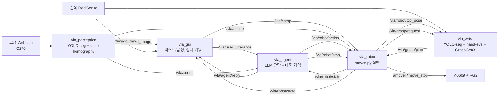

# 자연어 대화 기반 자율 피킹 로봇팔

사용자가 계속 말을 걸면 로봇이 맥락을 이해하고 물건을 집어 장바구니에 담는 시스템이다.
Doosan M0609 + OnRobot RG2 + 고정 Webcam(Logitech C270) + 손목 Intel RealSense D435I 기준.

"사과는 네가 담을거야" → 로봇이 사과를 집어 담고, 담는 도중 "그 사과는 집지마" →
지금 향하던 사과를 즉시 취소한다.

## 설계 원칙

**인식과 좌표 변환만 고정 로직이다. 나머지 판단은 전부 LLM이 한다.**

무엇을 집을지, 무엇을 빼고 들지, 애매하면 되물을지는 코드의 상태머신이 아니라
LLM이 결정한다. 규칙 매처(`matcher.py`), 대상 큐(`target_queue`),
되묻기 상태 플래그(`awaiting_clarification`)는 전부 제거했고, 그 역할은 대화
히스토리와 function calling이 대신한다.

- LLM은 **영상을 직접 보지 않는다.** 그 순간의 탐지 결과를 구조화된 JSON
  스냅샷으로만 받는다.
- LLM은 **매 프레임이 아니라 "결정 시점"에만** 호출된다 — 사용자가 말했을 때,
  그리고 로봇이 동작을 끝냈을 때.
- **"정지"는 LLM을 거치지 않는다.** GUI가 키워드를 로컬에서 잡아
  하드웨어 중단 서비스를 직접 호출한다.

## 구조



| 노드 | 책임 | 판단하는가 |
|---|---|---|
| `vla_perception` | 고정 Webcam 캡처, YOLO-seg 인스턴스 분할, IoU 추적, 마스크 색상, table homography로 base 좌표 | 아니오 (고정 로직) |
| `vla_agent` | 결정 시점마다 LLM 호출, 대화 히스토리 유지, function calling | **예 (전부)** |
| `vla_robot` | 액션을 실제 모션으로, 정지 경로 소유, 로봇 실제 상태 발행 | 아니오 (실행만) |
| `vla_wrist` | 손목 RealSense YOLO-seg, hand-eye 변환, GraspGenX 6-DOF 파지 생성 | 아니오 (고정 로직) |
| `vla_gui` | 입출력, STT, 정지 키워드 하드코딩, 되묻기 crop 표시, 손목 RealSense 화면 | 정지 키워드만 |

## LLM이 호출할 수 있는 함수

| 함수 | 하는 일 |
|---|---|
| `pick_and_place(object_id, reason)` | 집어서 장바구니에 담는다 |
| `pick_and_hold(object_id, reason)` | 집어서 든 채로 대기한다 |
| `release()` | 들고 있는 물체를 현재 위치에 놓는다 |
| `cancel_current_action()` | 진행 중인 동작을 즉시 중단한다 |
| `ask_clarification(question, object_ids)` | 애매하면 추측하지 않고 되묻는다 |
| `wait()` | 지금은 할 일 없음 |

`object_ids`를 넘기면 GUI가 `annotated_image`에서 해당 물체들을 잘라
번호를 붙여 보여주고, 사용자는 "1번"으로 답할 수 있다.

## LLM이 보는 것

매 결정 시점마다 아래가 새로 만들어져 주입된다. scene은 히스토리에 쌓이지 않는다 —
30초 전 좌표를 근거로 추론하는 일을 막기 위해서다.

```json
{
  "event": {"type": "user_said", "text": "사과 담아줘"},
  "scene": {
    "visible_objects": [
      {"id": "apple_17", "class": "apple", "color": "red",
       "pickable": true, "position_base": [0.42, -0.18, 0.05]},
      {"id": "apple_22", "class": "apple", "color": "red",
       "pickable": true, "position_base": [0.51, -0.10, 0.04]}
    ]
  },
  "robot_state": {"status": "idle", "holding": null, "motion_enabled": false}
}
```

`robot_state`는 LLM의 기억보다 항상 우선한다. 대화 히스토리는 로봇의 "기억"이지만,
실제로 무엇을 쥐고 있는지는 매번 `vla_robot`이 관측한 값으로 덮어쓴다.

## 정지가 실제로 즉시 먹히는 이유

기존 구조는 `movel`을 블로킹으로 순차 실행해서, "정지"가 들어와도 진행 중인
`movel`이 끝날 때까지 반영되지 않았다. 지금은:

1. 모든 긴 모션을 `amovel`/`amovej`(비블로킹)로 발행하고 `check_motion()`으로 폴링한다.
   폴링 주기(`poll_interval_s`, 기본 20 ms)마다 취소 플래그를 확인한다.
2. GUI가 "정지"를 로컬 정규식으로 잡아 `/vla/estop`을 즉시 발행한다.
   STT→LLM 왕복을 기다리지 않는다.
3. `vla_robot`이 취소 플래그를 세우고 동시에 Doosan `motion/move_stop`
   서비스를 `call_async`로 호출한다. 이 클라이언트는 `vla_robot` 자신의
   executor 위에 있어서, 모션 워커 스레드가 Doosan API를 쓰고 있어도 충돌하지 않는다.

ESC 키와 화면 우상단 **■ 정지** 버튼도 같은 경로다.

**진행 중인 "판단"도 무효화한다.** LLM 왕복은 몇 초가 걸리므로, 그 사이에 정지가
들어오면 정지 *이전*의 세계관으로 만들어진 동작이 정지 *이후*에 발행될 수 있다.
두 겹으로 막는다.

- `vla_agent`는 판단 시작 시점의 stop epoch을 기억하고, 동작을 발행하기 직전에
  epoch이 바뀌었으면 발행하지 않는다.
- `vla_robot`은 `RobotAction.header.stamp`(판단을 *시작*한 시각)가 마지막 정지보다
  이르면 거부한다. 에이전트가 정지를 듣기 전에 이미 메시지를 보냈더라도 막힌다.

## 좌표가 어디서 오는가

탐지 카메라는 **고정 Webcam**이다. RealSense는 손목에 있으므로 테이블을 조망할 수
없다 — 무엇이 보이는지가 팔이 어디를 향하는지에 달려 있어서 장면 소스로 쓸 수 없다.
Webcam은 움직이지 않으니 보정 한 번이 계속 유효하다.

카메라 하나에는 깊이가 없다. 그래서 좌표는 `table_homography_test`로 측정한 테이블
보정에서 온다: 픽셀 → base XY, 그리고 최소제곱으로 맞춘 테이블 평면에서 Z.

여기에는 **물체가 보정한 테이블 위에 놓여 있다**는 가정이 하나 붙는다. 키가 있는
물체의 마스크 중심은 그 물체의 윗면에 있으므로, 매핑은 "그 윗면이 테이블에 닿는다면
어디일지"를 답한다 — 높이와 광축에서의 거리에 비례해 커지는 시차 오차다. 올바른
물체로 팔을 보내기에는 충분하지만, 눈을 감고 손가락을 닫기에는 부족하다. 그것이
나중에 손목 RealSense가 할 일이다.

- 매핑하는 픽셀은 박스 중심이 아니라 **마스크 무게중심**이다. 기울어진 바나나나
  일부가 가려진 컵에서는 박스 중심이 물체 옆 테이블에 떨어질 수 있다.
- 파지 Z는 `테이블 평면 + grasp_height_offset_m`이다. 로봇은 건네받은 Z에서 정확히
  그리퍼를 닫으므로(`moves.py`의 `grasp = posx([x, y, z])`), 맨 테이블 Z를 주면
  손가락이 테이블을 찍는다. 이 offset은 물체 높이의 무딘 대역이며, 조망 한 장에서는
  높이를 측정할 수 없다.
- 보정 사각형 **밖**의 물체는 좌표를 받지 못한다. 그 밖에서는 homography가
  외삽이고 평면도 함께 외삽된다. 물체 자체는 장면에 남으므로 LLM은 "보인다"고
  말할 수 있지만 집으러 가지는 못한다.

보정은 **픽셀 좌표**라서 해상도가 바뀌면 전부 무의미해진다. 그래서 보정 JSON에
`image_size`를 함께 저장하고, `vla_perception`이 다른 해상도로 Webcam을 열면
보정을 거부한다.

무압축 720p는 USB 2에서 대역폭에 묶여 blocking read가 196 ms였다 (약 5 fps).
MJPEG로 바꾸면 같은 해상도에서 64 ms다. 압축은 픽셀을 옮기지 않으므로 보정에
영향이 없다. `webcam_fourcc` 기본값이 `MJPG`인 이유다.

## 두 카메라가 나누어 맡는 일

고정 Webcam은 **무엇을 어디쯤**, 손목 RealSense는 **어떻게 잡을지**를 답한다.

Webcam homography는 물체가 테이블 위에 있다고 가정하므로, 키가 있는 물체는 상단면
시차만큼 좌표가 밀린다. 올바른 물체로 팔을 보내기엔 충분하지만 눈 감고 손가락을
닫기엔 부족하다. 그래서 팔이 근처로 가는 동안부터 손목 카메라가 계속 다시 본다.

```
손목에 목표 등록 (/vla/grasp/request)
  → webcam 좌표 위 observe_height_m 높이로 이동하면서
     RGB + aligned depth + 같은 시각의 TCP pose를 계속 동기화
  → 손목 YOLO-seg: class/기준좌표가 연속 3프레임 일치
  → 일치한 한 프레임의 마스크 점군으로 GraspGenX를 정확히 한 번 실행
  → 정지 epoch 재확인
  → pregrasp → grasp → 닫기
```

### 동일 객체 판정

`class 일치 AND 수평거리 < match_tolerance_m`. **수평만** 비교한다 — webcam의 Z는
테이블 평면 + `grasp_height_offset_m`이고 손목은 실제 표면을 재므로, 3D 거리로
비교하면 정상 매칭도 전부 탈락한다. 같은 종류가 비슷하게 가까이 둘 있으면 추측하지
않고 거부한다 (`refuse_ambiguous_match`).

### GraspGenX 자세 규약 — 측정으로 확정한 것

`onrobot_RG2`는 built-in으로 지원된다 (`type: revolute_2f`). 출력 4x4는 **그리퍼
base** 기준이고, 실제 접촉점은 `원점 + R @ fingertip`이며 fingertip은 `[0,0,0.18]`,
즉 **접근축은 local +Z**다. 릴리스 모델로 직접 재서 확인했다:

| 측정 | 결과 |
|---|---|
| 자세 원점 → 물체 표면 | 중앙값 158.8 mm |
| 원점 + R@fingertip → 표면 | 중앙값 4.3 mm |
| fingertip 방향 · R의 3열 | 1.000000 |

이걸 적용하지 않으면 모든 파지가 정확히 180 mm 빗나가는데, 로봇에서는 "캘리브레이션이
나쁜 것"처럼 보여 원인을 찾기 어렵다.

Doosan TCP(`GripperDA_v1`)는 손가락 끝에 있으므로 명령하는 것은 **접촉점**이다.

### TCP가 반드시 일치해야 하는 이유

hand-eye 보정은 `set_tcp("GripperDA_v1")` 상태에서 기록됐다. `get_current_posx()`는
컨트롤러에 현재 걸린 TCP를 반환하므로, 런타임에 다른 TCP가 걸려 있으면
`base2gripper @ T_camera→gripper` 전체가 무의미해진다. 그래서 `vla_robot`이 기동 시
`set_tool`/`set_tcp`를 명시적으로 설정하고, `vla_wrist`는 로봇이 보고한 TCP 이름이
`expected_tcp_name`과 다르면 좌표 변환과 파지 계획을 거부한다.

이동 중에는 영상 한 장과 현재 pose 한 장을 임의로 섞지 않는다. `vla_robot`이 활성
요청 ID를 붙여 선택된 TCP를 10 Hz로 읽고(서비스 왕복 시각의 중간값으로 stamp),
`vla_wrist`가 요청 이후의 같은-stamp RGB/depth와 영상 전후로 bracket된 가장 가까운
TCP 샘플만 사용한다. 한 프레임에서 YOLO가 비어도 즉시 실패하지 않고 다음 프레임을
계속 관찰한다.

### 관찰 자세와 실제 도달 확인

`amovel` 서비스의 `success=true`는 명령 접수일 뿐이다. M0609가 그 직후 1206
`NOT REACHABLE`을 내면 `check_motion()`은 처음부터 계속 IDLE일 수 있다. 따라서 모든
Cartesian/관절 모션은 종료 뒤 실제 TCP/관절을 목표와 비교하며, 도달하지 않은 팔로
파지나 그리퍼 닫기를 이어가지 않는다.

관찰 자세는 먼저 기존처럼 TCP를 webcam 좌표 위에 둔다. IK→FK 왕복 검증에서 얻은 관절
해를 그대로 실행해서, 경계 근사 관절 해를 검증해 놓고 별도의 정확한 Cartesian 목표를
보내 `NOT REACHABLE`이 되는 판정·실행 불일치를 없앤다. 그 자세가 왕복 검증에 실패하면
`T_gripper2camera.npy`의 측면 장착 오프셋을 이용한다. 카메라가 바깥을 향하도록 top-down
yaw를 돌리고 카메라 시점을 객체보다 최대 140 mm 안쪽에 두어, 객체는 D435 화면 안에
유지하면서 TCP는 로봇의 도달 영역 안으로 당긴다. 직접/대체 자세 모두 optical axis가
아래쪽 10° 안에 있을 때만 허용하고, 먼저 TCP를 base Z 280 mm까지 수직 상승시킨 뒤 검증된
현재 solution-space 관절 해로 이동한다. 최종 TCP와 관절도 실제 도달을 다시 확인한다.

### 계획 중 정지

GraspGenX 추론은 약 1.6초다. 그 사이 "정지"가 들어오면, 정지 *이전*의 세계관으로
만들어진 파지가 정지 *이후*에 실행될 수 있다. `vla_robot`은 계획을 요청한 시각을
기억하고 실행 직전에 stop epoch을 다시 확인한다 — 에이전트가 LLM 왕복에 대해 주는
보장과 같은 것이다. 폴링 주기도 `poll_interval_s`라서 정지 반응 지연의 상한이
다른 모션과 동일하다.

### 실측 비용 (RTX 4060 Laptop 8 GB)

| 항목 | 값 |
|---|---|
| GraspGenX VRAM 피크 | 1163 MB |
| 추론 | 약 1.6 s / 물체 |
| 모델 로드 | 약 15 s (1회) |

YOLO-seg 두 개(webcam + 손목)와 함께 8 GB 안에 들어간다.

### 파지가 실패할 때

손목이 계획을 못 내면 (물체가 프레임 밖, depth 구멍, 필터에 전부 걸림)
`wrist_grasp_fallback`이 true면 기존 webcam 좌표 파지로 되돌아간다. false면 동작이
`failed`로 끝난다. 단, 관찰/접근 모션 자체가 도달하지 못한 경우는 카메라 계획 실패가
아니므로 fallback하지 않고 즉시 `failed`로 끝낸다. 손목 경로 자체를 끄려면
`use_wrist_grasp: false`.

## 시작할 때 찌꺼기를 먼저 정리하는 이유

**VLA 시작**은 누를 때마다 먼저 남아있는 파이프라인 프로세스를 정리한다.

GUI를 닫거나 죽여도 그것이 띄운 `ros2 launch`는 살아남는다 — OS 차원의 부모-자식
종료 연결이 없기 때문이다. 그래서 새 GUI는 이전 실행을 기억하지 못하고, 그대로
시작하면 `robot_node`가 둘이 되어 같은 팔에 서로 다른 동작을 동시에 보낸다.
launch에서 노드 하나만 죽어 형제들보다 오래 남는 경우도 있다. 찌꺼기는 예외가
아니라 정상 상황이라서, 사용자에게 터미널에서 정리하라고 요구하지 않고 매번
자동으로 처리한다.

- `SIGINT` → `SIGTERM` → `SIGKILL` 순으로 올린다. `SIGINT`에서 rclpy가 정상
  종료하며 gripper 클라이언트를 놓기 때문에 이것이 먼저다.
- 다 죽으면 즉시 넘어간다. 정상적인 노드 3개는 **0.1초**, 완전히 굳은 노드가
  섞여 있어도 상한이 7초다.
- `SIGKILL`에도 남는 것이 있으면 그때만 시작을 막고 알린다.
- **자기 자신과 자기 조상 프로세스는 절대 건드리지 않는다.**
  `bash -c "... ros2 launch vla_system ..."` 같은 래퍼 셸은 자기 명령줄에 launch
  명령을 담고 있어서 `pgrep`에 파이프라인처럼 잡힌다. 그걸 죽이면 정리 도중에
  호출자가 사라진다.
- 좀비는 살아있는 것으로 세지 않는다. `os.kill(pid, 0)`은 좀비에도 성공하므로,
  신호만으로는 자기가 방금 죽인 자식의 사망을 확인할 수 없다.

로직은 `vla_system/process_guard.py`에 있다 — tkinter도 ROS도 없이 테스트할 수
있도록 GUI에서 분리했다.

## 설치

Ubuntu 22.04 + ROS 2 Humble 기준.

```bash
cd ~/M0609_VLA_system
source /opt/ros/humble/setup.bash

sudo apt update
sudo apt install -y ros-humble-realsense2-camera portaudio19-dev python3-tk

# ⚠️ --user 로 깔지 않는다 — 이 계정(kimkh)은 ~/cobot2_ws 와 공유한다. ~/.local 은 계정
# 전역이라 여기서 pip install --user 로 깐 opencv-python/pydantic 등이 cobot2_ws 의
# colcon build·rclpy 노드를 조용히 깬다(2026-08-10 실측 — CLAUDE.md §1).
# 이 ws 는 rclpy 가 필요한 진짜 ROS 패키지라 일반 venv 는 안 되고 --system-site-packages 다.
python3 -m venv --system-site-packages .venv
source .venv/bin/activate
python3 -m pip install -r requirements.txt
# --system-site-packages 의 apt packaging(21.3)과 최신 setuptools 가 안 맞을 수 있다
# (2026-08-10 실측 — vla_interfaces 빌드가 TypeError 로 죽었다):
python3 -m pip install "setuptools<80,>=30.3.0" "packaging>=23"
```

OpenCV는 apt(`python3-opencv`, jammy에서 4.5.4)가 아니라 pip로 받는다 —
`ultralytics`가 `opencv-python>=4.7`을 요구한다. 대신 4.x에 머물러야 한다:
`opencv-python` 5.x는 NumPy 2를 강제하고, NumPy는 ROS 2 Humble ABI 호환을 위해
1.x로 고정돼 있다. `requirements.txt`가 이 조합을 이미 못박아 뒀다.

**설치 전후로 `~/cobot2_ws` 가 멀쩡한지 확인한다** (같은 계정을 공유하므로):

```bash
source /opt/ros/humble/setup.bash && source ~/cobot2_ws/install/setup.bash
cd ~/cobot2_ws && colcon build --symlink-install --packages-select voice_processing pick_fsm
```

이게 실패로 바뀌었으면 방금 설치가 `~/.local`을 건드린 것이다 — `.venv` 활성화 없이
`pip install`을 부르지 않았는지부터 본다. 상세는 `CLAUDE.md` §1.

Doosan ROS 2 패키지(`dsr_common2`, `dsr_msgs2`, `DSR_ROBOT2`)가 들어 있는
overlay를 먼저 source한다. `scripts/env.sh`가 ROS · Doosan overlay ·
이 워크스페이스 · `.env`를 한 번에 올려준다.

```bash
export DOOSAN_SETUP=~/cobot_ws/install/setup.bash   # overlay 위치가 다르면 여기서 지정
source scripts/env.sh
./scripts/build.sh
source scripts/env.sh    # install/ 이 생긴 뒤 한 번 더
```

`src/`에 `doosan-robot2`를 같이 뒀다면 `COLCON_IGNORE`를 넣어 overlay와 이중
빌드되지 않게 한다.

## API 키

```bash
cp src/vla_system/.env.example .env
nano .env          # OPENAI_API_KEY=...
```

또는 `export OPENAI_API_KEY='...'`.

## 실행

### 1. 로봇 없이 (DRY-RUN)

`vla_robot`이 좌표와 작업공간을 검증하고 동작 시간만 흉내 낸다. 실제 팔은 움직이지
않는다. 대화 흐름, 되묻기, 정지 경로를 전부 이 상태에서 검증할 수 있다.

```bash
source scripts/env.sh

ros2 run vla_system vla_gui
```

GUI에서 **VLA 시작**을 누르면 파이프라인이 뜬다. RealSense를 이미 다른 곳에서
돌리고 있다면 터미널에서 직접:

```bash
ros2 launch vla_system vla_system.launch.py enable_realsense:=false
```

손목 파지를 쓰려면 명시적으로 켠다 (두 번째 YOLO + GraspGenX를 올리므로 기본 꺼짐):

```bash
ros2 launch vla_system vla_system.launch.py enable_wrist_grasp:=true
```

### 2. 실제 로봇

Doosan bringup과 RG2 네트워크를 먼저 확인한다.

```bash
ros2 launch m0609_rg2_bringup bringup.launch.py \
  mode:=real host:=192.168.1.100 model:=m0609
```

GUI에서 **실제 로봇 모션**을 체크한 뒤 시작하거나, 직접:

```bash
ros2 launch vla_system vla_system.launch.py motion_enabled:=true
```

실행 전 `src/vla_system/config/system.yaml`에서 반드시 확인할 것:

- 테이블 보정(`~/.ros/vla_table_homography.json`)이 현재 Webcam 설치와 테이블
  위치에 맞는가. Webcam이나 테이블을 건드렸으면 다시 측정해야 한다
  (없거나 못 읽으면 GUI 상단에 ⚠ 표시가 뜨고 모든 물체가 "집기 가능 X"가 된다)
- `grasp_height_offset_m`이 집을 물체 높이에 맞는가
- `workspace_*_m`가 실제 안전 작업공간보다 작게 설정됐는가
- `place_joints`가 충돌 없는 위치인가
- RG2 IP/포트/힘이 실제 장비와 일치하는가

## 설정

`src/vla_system/config/system.yaml` 한 파일에 세 노드의 파라미터가 모두 있다.

주요 항목:

| 파라미터 | 의미 |
|---|---|
| `vla_agent.model` | 판단에 쓰는 모델 (기본 `gpt-5-mini`) |
| `vla_agent.max_tool_rounds` | 한 결정 안에서 허용하는 tool 왕복 수 |
| `vla_agent.max_history_items` | 이 개수를 넘으면 오래된 턴부터 통째로 버린다 |
| `vla_agent.max_consecutive_failures` | 연속 실패가 이만큼이면 자동 진행을 멈추고 사용자에게 묻는다 |
| `vla_robot.motion_enabled` | 실제 모션 스위치. 기본 false |
| `vla_robot.stop_mode` | MoveStop 모드. 0=QSTOP_STO, 1=QSTOP, 2=SSTOP, 3=HOLD |
| `vla_robot.poll_interval_s` | 정지 반응 지연의 상한 |
| `vla_robot.max_scene_age_s` | 이보다 오래된 장면으로는 집으러 가지 않는다 |
| `vla_perception.backend` / `device` | `pytorch` + `cuda:0` (기본) 또는 `openvino` + `intel:gpu` |
| `vla_perception.webcam_device` | 고정 Webcam 장치. `/dev/video*` 이름으로 확인할 것 |
| `vla_perception.webcam_fourcc` | 기본 `MJPG`. 무압축 720p는 USB 2에서 ~5 fps로 묶인다 |
| `vla_perception.calibration_file` | `table_homography_test`가 저장한 보정. 없으면 좌표가 전부 보류된다 |
| `vla_perception.grasp_height_offset_m` | 테이블 높이에 더해 파지 Z를 만든다 (기본 0.02) |
| `vla_perception.require_inside_table` | 보정 사각형 밖 물체는 좌표를 주지 않는다 (기본 true) |
| `vla_perception.use_masks` | 색상 판정과 테이블에 매핑할 픽셀을 마스크 안쪽으로 제한한다 (기본 true) |
| `vla_robot.dry_run_motion_s` | DRY-RUN에서 모션 한 구간이 걸리는 시간. 말로 끼어들어 테스트하려면 늘린다 |

좌표 단위 계약:

- `SceneObject.position_base`, workspace 파라미터: **m**
- `table_homography.py`의 모든 공개 함수와 보정 JSON: **mm** (Doosan API와 맞춤).
  `table_point_from_pixel()`이 유일한 mm→m 경계다
- Doosan `posx`: `moves.py` 내부에서만 mm로 변환

## 테스트

```bash
source .venv/bin/activate   # 없으면 위 설치 절부터 (--user 금지 — CLAUDE.md §1)
python3 -m pip install -r requirements-dev.txt
./scripts/check.sh
```

순수 로직만 다룬다 — ROS도 카메라도 로봇도 필요 없다.

```text
196 passed
XML/YAML validation passed
```

커버 범위: 대화 히스토리 트리밍(고아 tool 출력 방지), scene/robot_state 직렬화,
작업공간 경계, 취소 전파와 파지 시점 보고, object handle 정규화, IoU 추적 동일성,
tool 스키마 strict 규약, 클래스 필터링 후 box↔mask 인덱스 정합, HSV 7색 밴드와
마스크 색상 판정, table homography 좌표(mm→m 경계, 보정 사각형 밖 거부, 해상도
불일치 거부, 손상된 보정 파일 거부), 잔여 프로세스 정리(신호 단계 상승, 좀비 판정,
조상 프로세스 보호).

### 실제 ROS 런타임에서 확인한 것

`colcon build` 후 DRY-RUN으로 세 노드를 실제로 띄워 확인했다 (로봇·카메라 없이,
장면은 가짜 publisher로 주입).

| 확인한 것 | 결과 |
|---|---|
| 모호한 지시("사과 담아줘", 사과 2개) | `ask_clarification` 호출, 후보 2개 id 전달 |
| 되묻기 답변("1번") | `pick_and_place(apple_17)` 발행 → 실행 → `succeeded` |
| 도중 제외("그 사과는 집지마") | 방금 자기가 호출한 대상임을 대화에서 인지 → `cancel_current_action` → **남은 apple_22로 스스로 이어감** → 이후에도 apple_17 재타겟 안 함 |
| 모션 중 정지 | `cancelled`, 파지 후였다면 `holding`이 유지됨 |
| 판단 중 정지 (LLM 왕복 사이) | 에이전트가 동작을 withheld, 팔에 전달조차 되지 않음 |
| 정지 이전에 결정된 동작이 뒤늦게 도착 | 로봇이 `rejected` |
| 들고 있지 않은데 `release` | 깨끗한 `failed` |
| 위치 미확정 물체 / 장면에 없는 id | 각각 `failed`, 모션 없음 |
| 실행 중 두 번째 동작 도착 | 큐에 쌓지 않고 `rejected`, 진행 중 동작은 그대로 완료 |

## 안전 설계

- `motion_enabled` 기본 false. GUI에서 명시적으로 체크해야 실제 모션이 켜진다
- 정지는 LLM을 거치지 않는 별도 경로 (GUI 키워드 / ESC / 정지 버튼 → `move_stop`)
- 모든 모션이 취소 가능. 폴링 주기마다 취소 플래그 확인
- 파지 완료 시점을 즉시 보고해서, 들어올리는 중 정지해도 "쥐고 있음"이 유실되지 않음
- 동시에 하나의 액션만 실행. 두 번째 액션은 큐에 쌓지 않고 거부
- 실행 직전 최신 scene에서 좌표를 다시 읽음 (LLM이 본 좌표는 이미 오래됨)
- 오래된 scene, 위치 미확정 물체, 작업공간 밖 좌표는 전부 거부
- 캘리브레이션 frame 불일치 시 좌표를 아예 발행하지 않음
- 연속 실패가 임계치를 넘으면 자동 진행을 멈추고 사용자에게 넘김
- 이미 물체를 들고 있으면 새로 집지 않음

## 남은 검증

이 코드를 작성한 환경에는 ROS 2 런타임, RealSense, Doosan 드라이버, 실제 장비가
없다. 대상 노트북에서 순서대로 확인해야 한다.

1. `colcon build --symlink-install`
2. 고정 Webcam 캡처와 테이블 보정 재측정, 매핑 좌표를 실제 자로 검증
3. DRY-RUN으로 시나리오 1~4 대화 검증 및 LLM 응답 지연 측정
4. `/dsr01/motion/move_stop` 서비스 존재 확인 (`ros2 service list | grep move_stop`)
5. 저속·넓은 안전공간에서 단일 물체 실제 pick, 모션 중 정지 반응 시간 측정
6. place joint, TCP 방향, gripper width/force 현장 보정

변경 내역은 `MIGRATION.md`에 정리돼 있다.
